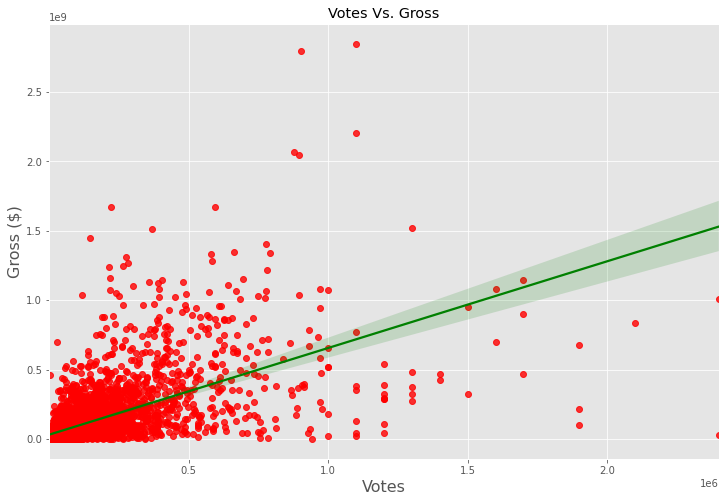

# DATA CORRELATION IN MOVIE INDUSTRY DATA USING PYTHON

##### NOTE: The csv file "movies.csv" has been downloaded from "https://www.kaggle.com/datasets/danielgrijalvas/movies".
##### The following steps are taken to analyze the data after it was downloaded and placed inside the same directory as the notebook.

### SETUP

#### IMPORT LIBRARIES


```python
import pandas as pd
import numpy as np
import seaborn as sns

import matplotlib
import matplotlib.pyplot as plt
plt.style.use('ggplot')
from matplotlib.pyplot import figure
from datetime import datetime

%matplotlib inline
matplotlib.rcParams['figure.figsize'] = (12, 8) # Adjusts the configuration of the plots
```

#### SET THE OPTION TO DISPLAY FULL DATAFRAME


```python
pd.set_option('display.max_rows', 20);
```

#### READ THE DATA


```python
data = pd.read_csv('movies.csv');
```


```python
data.head()
```


<div>
<style scoped>
    .dataframe tbody tr th:only-of-type {
        vertical-align: middle;
    }

    .dataframe tbody tr th {
        vertical-align: top;
    }

    .dataframe thead th {
        text-align: right;
    }
</style>
<table border="1" class="dataframe">
  <thead>
    <tr style="text-align: right;">
      <th></th>
      <th>name</th>
      <th>rating</th>
      <th>genre</th>
      <th>year</th>
      <th>released</th>
      <th>score</th>
      <th>votes</th>
      <th>director</th>
      <th>writer</th>
      <th>star</th>
      <th>country</th>
      <th>budget</th>
      <th>gross</th>
      <th>company</th>
      <th>runtime</th>
    </tr>
  </thead>
  <tbody>
    <tr>
      <th>0</th>
      <td>The Shining</td>
      <td>R</td>
      <td>Drama</td>
      <td>1980</td>
      <td>June 13, 1980 (United States)</td>
      <td>8.4</td>
      <td>927000.0</td>
      <td>Stanley Kubrick</td>
      <td>Stephen King</td>
      <td>Jack Nicholson</td>
      <td>United Kingdom</td>
      <td>19000000.0</td>
      <td>46998772.0</td>
      <td>Warner Bros.</td>
      <td>146.0</td>
    </tr>
    <tr>
      <th>1</th>
      <td>The Blue Lagoon</td>
      <td>R</td>
      <td>Adventure</td>
      <td>1980</td>
      <td>July 2, 1980 (United States)</td>
      <td>5.8</td>
      <td>65000.0</td>
      <td>Randal Kleiser</td>
      <td>Henry De Vere Stacpoole</td>
      <td>Brooke Shields</td>
      <td>United States</td>
      <td>4500000.0</td>
      <td>58853106.0</td>
      <td>Columbia Pictures</td>
      <td>104.0</td>
    </tr>
    <tr>
      <th>2</th>
      <td>Star Wars: Episode V - The Empire Strikes Back</td>
      <td>PG</td>
      <td>Action</td>
      <td>1980</td>
      <td>June 20, 1980 (United States)</td>
      <td>8.7</td>
      <td>1200000.0</td>
      <td>Irvin Kershner</td>
      <td>Leigh Brackett</td>
      <td>Mark Hamill</td>
      <td>United States</td>
      <td>18000000.0</td>
      <td>538375067.0</td>
      <td>Lucasfilm</td>
      <td>124.0</td>
    </tr>
    <tr>
      <th>3</th>
      <td>Airplane!</td>
      <td>PG</td>
      <td>Comedy</td>
      <td>1980</td>
      <td>July 2, 1980 (United States)</td>
      <td>7.7</td>
      <td>221000.0</td>
      <td>Jim Abrahams</td>
      <td>Jim Abrahams</td>
      <td>Robert Hays</td>
      <td>United States</td>
      <td>3500000.0</td>
      <td>83453539.0</td>
      <td>Paramount Pictures</td>
      <td>88.0</td>
    </tr>
    <tr>
      <th>4</th>
      <td>Caddyshack</td>
      <td>R</td>
      <td>Comedy</td>
      <td>1980</td>
      <td>July 25, 1980 (United States)</td>
      <td>7.3</td>
      <td>108000.0</td>
      <td>Harold Ramis</td>
      <td>Brian Doyle-Murray</td>
      <td>Chevy Chase</td>
      <td>United States</td>
      <td>6000000.0</td>
      <td>39846344.0</td>
      <td>Orion Pictures</td>
      <td>98.0</td>
    </tr>
  </tbody>
</table>
</div>


```python
data.dtypes
```


    name         object
    rating       object
    genre        object
    year          int64
    released     object
    score       float64
    votes       float64
    director     object
    writer       object
    star         object
    country      object
    budget      float64
    gross       float64
    company      object
    runtime     float64
    dtype: object


### DATA CLEANING

####  FIND THE MISSING DATA (IF ANY)?


```python
print('ORIGINAL DATA\n')

print('{0:<10} {1:<15}'.format("Column", "Data Missing"))

for col in data.columns:
    missing = np.round(np.mean(data[col].isnull())*100, 2)
    print('{0:<10} {1}%'.format(col, missing))
```

    ORIGINAL DATA
    
    Column     Data Missing   
    name       0.0%
    rating     1.0%
    genre      0.0%
    year       0.0%
    released   0.03%
    score      0.04%
    votes      0.04%
    director   0.0%
    writer     0.04%
    star       0.01%
    country    0.04%
    budget     28.31%
    gross      2.46%
    company    0.22%
    runtime    0.05%


#### REMOVE MISSING DATA ROWS


```python
data = data.dropna()

print('AFTER MISSING DATA REMOVED\n')

print('{0:<10} {1:<15}'.format("Column", "Data Missing"))

for col in data.columns:
    missing = np.round(np.mean(data[col].isnull())*100, 2)
    print('{0:<10} {1}%'.format(col, missing))
```

    AFTER MISSING DATA REMOVED
    
    Column     Data Missing   
    name       0.0%
    rating     0.0%
    genre      0.0%
    year       0.0%
    released   0.0%
    score      0.0%
    votes      0.0%
    director   0.0%
    writer     0.0%
    star       0.0%
    country    0.0%
    budget     0.0%
    gross      0.0%
    company    0.0%
    runtime    0.0%


#### REMOVE THE DECIMAL FROM 'BUDGET', 'GROSS',  'RUNTIME' & 'VOTES' (THE DP IS UNNECESSARY )


```python
data['budget'] = data['budget'].astype(int)

data['gross'] = data['gross'].astype(int)

data['runtime'] = data['runtime'].astype(int)

data['votes'] = data['votes'].astype(int)
```


```python
data.head()
```


<div>
<style scoped>
    .dataframe tbody tr th:only-of-type {
        vertical-align: middle;
    }

    .dataframe tbody tr th {
        vertical-align: top;
    }

    .dataframe thead th {
        text-align: right;
    }
</style>
<table border="1" class="dataframe">
  <thead>
    <tr style="text-align: right;">
      <th></th>
      <th>name</th>
      <th>rating</th>
      <th>genre</th>
      <th>year</th>
      <th>released</th>
      <th>score</th>
      <th>votes</th>
      <th>director</th>
      <th>writer</th>
      <th>star</th>
      <th>country</th>
      <th>budget</th>
      <th>gross</th>
      <th>company</th>
      <th>runtime</th>
    </tr>
  </thead>
  <tbody>
    <tr>
      <th>0</th>
      <td>The Shining</td>
      <td>R</td>
      <td>Drama</td>
      <td>1980</td>
      <td>June 13, 1980 (United States)</td>
      <td>8.4</td>
      <td>927000</td>
      <td>Stanley Kubrick</td>
      <td>Stephen King</td>
      <td>Jack Nicholson</td>
      <td>United Kingdom</td>
      <td>19000000</td>
      <td>46998772</td>
      <td>Warner Bros.</td>
      <td>146</td>
    </tr>
    <tr>
      <th>1</th>
      <td>The Blue Lagoon</td>
      <td>R</td>
      <td>Adventure</td>
      <td>1980</td>
      <td>July 2, 1980 (United States)</td>
      <td>5.8</td>
      <td>65000</td>
      <td>Randal Kleiser</td>
      <td>Henry De Vere Stacpoole</td>
      <td>Brooke Shields</td>
      <td>United States</td>
      <td>4500000</td>
      <td>58853106</td>
      <td>Columbia Pictures</td>
      <td>104</td>
    </tr>
    <tr>
      <th>2</th>
      <td>Star Wars: Episode V - The Empire Strikes Back</td>
      <td>PG</td>
      <td>Action</td>
      <td>1980</td>
      <td>June 20, 1980 (United States)</td>
      <td>8.7</td>
      <td>1200000</td>
      <td>Irvin Kershner</td>
      <td>Leigh Brackett</td>
      <td>Mark Hamill</td>
      <td>United States</td>
      <td>18000000</td>
      <td>538375067</td>
      <td>Lucasfilm</td>
      <td>124</td>
    </tr>
    <tr>
      <th>3</th>
      <td>Airplane!</td>
      <td>PG</td>
      <td>Comedy</td>
      <td>1980</td>
      <td>July 2, 1980 (United States)</td>
      <td>7.7</td>
      <td>221000</td>
      <td>Jim Abrahams</td>
      <td>Jim Abrahams</td>
      <td>Robert Hays</td>
      <td>United States</td>
      <td>3500000</td>
      <td>83453539</td>
      <td>Paramount Pictures</td>
      <td>88</td>
    </tr>
    <tr>
      <th>4</th>
      <td>Caddyshack</td>
      <td>R</td>
      <td>Comedy</td>
      <td>1980</td>
      <td>July 25, 1980 (United States)</td>
      <td>7.3</td>
      <td>108000</td>
      <td>Harold Ramis</td>
      <td>Brian Doyle-Murray</td>
      <td>Chevy Chase</td>
      <td>United States</td>
      <td>6000000</td>
      <td>39846344</td>
      <td>Orion Pictures</td>
      <td>98</td>
    </tr>
  </tbody>
</table>
</div>


#### ARE THERE DISCREPANCIES BETWEEN THE YEAR IN THE COLUMNS 'RELEASED' AND 'YEAR'?


```python
mismatch = data[pd.to_datetime(data['released'].str.split(' \(').str[0]).dt.year != data['year']]

mismatch
```


<div>
<style scoped>
    .dataframe tbody tr th:only-of-type {
        vertical-align: middle;
    }

    .dataframe tbody tr th {
        vertical-align: top;
    }

    .dataframe thead th {
        text-align: right;
    }
</style>
<table border="1" class="dataframe">
  <thead>
    <tr style="text-align: right;">
      <th></th>
      <th>name</th>
      <th>rating</th>
      <th>genre</th>
      <th>year</th>
      <th>released</th>
      <th>score</th>
      <th>votes</th>
      <th>director</th>
      <th>writer</th>
      <th>star</th>
      <th>country</th>
      <th>budget</th>
      <th>gross</th>
      <th>company</th>
      <th>runtime</th>
    </tr>
  </thead>
  <tbody>
    <tr>
      <th>8</th>
      <td>Superman II</td>
      <td>PG</td>
      <td>Action</td>
      <td>1980</td>
      <td>June 19, 1981 (United States)</td>
      <td>6.8</td>
      <td>101000</td>
      <td>Richard Lester</td>
      <td>Jerry Siegel</td>
      <td>Gene Hackman</td>
      <td>United States</td>
      <td>54000000</td>
      <td>108185706</td>
      <td>Dovemead Films</td>
      <td>127</td>
    </tr>
    <tr>
      <th>11</th>
      <td>The Gods Must Be Crazy</td>
      <td>PG</td>
      <td>Adventure</td>
      <td>1980</td>
      <td>October 26, 1984 (United States)</td>
      <td>7.3</td>
      <td>54000</td>
      <td>Jamie Uys</td>
      <td>Jamie Uys</td>
      <td>N!xau</td>
      <td>South Africa</td>
      <td>5000000</td>
      <td>30031783</td>
      <td>C.A.T. Films</td>
      <td>109</td>
    </tr>
    <tr>
      <th>21</th>
      <td>Heaven's Gate</td>
      <td>R</td>
      <td>Adventure</td>
      <td>1980</td>
      <td>April 24, 1981 (United States)</td>
      <td>6.8</td>
      <td>14000</td>
      <td>Michael Cimino</td>
      <td>Michael Cimino</td>
      <td>Kris Kristofferson</td>
      <td>United States</td>
      <td>44000000</td>
      <td>3484523</td>
      <td>Partisan Productions</td>
      <td>219</td>
    </tr>
    <tr>
      <th>33</th>
      <td>Cattle Annie and Little Britches</td>
      <td>PG</td>
      <td>Drama</td>
      <td>1980</td>
      <td>April 24, 1981 (United States)</td>
      <td>6.1</td>
      <td>604</td>
      <td>Lamont Johnson</td>
      <td>David Eyre</td>
      <td>Scott Glenn</td>
      <td>United States</td>
      <td>5100000</td>
      <td>534816</td>
      <td>Cattle Annie Productions</td>
      <td>97</td>
    </tr>
    <tr>
      <th>96</th>
      <td>The Evil Dead</td>
      <td>NC-17</td>
      <td>Horror</td>
      <td>1981</td>
      <td>April 15, 1983 (United States)</td>
      <td>7.5</td>
      <td>192000</td>
      <td>Sam Raimi</td>
      <td>Sam Raimi</td>
      <td>Bruce Campbell</td>
      <td>United States</td>
      <td>350000</td>
      <td>2956630</td>
      <td>Renaissance Pictures</td>
      <td>85</td>
    </tr>
    <tr>
      <th>...</th>
      <td>...</td>
      <td>...</td>
      <td>...</td>
      <td>...</td>
      <td>...</td>
      <td>...</td>
      <td>...</td>
      <td>...</td>
      <td>...</td>
      <td>...</td>
      <td>...</td>
      <td>...</td>
      <td>...</td>
      <td>...</td>
      <td>...</td>
    </tr>
    <tr>
      <th>7427</th>
      <td>Stan &amp; Ollie</td>
      <td>PG</td>
      <td>Biography</td>
      <td>2018</td>
      <td>January 11, 2019 (United Kingdom)</td>
      <td>7.2</td>
      <td>34000</td>
      <td>Jon S. Baird</td>
      <td>Jeff Pope</td>
      <td>Steve Coogan</td>
      <td>United Kingdom</td>
      <td>10000000</td>
      <td>24420923</td>
      <td>Entertainment One</td>
      <td>98</td>
    </tr>
    <tr>
      <th>7432</th>
      <td>Dragon Ball Super: Broly</td>
      <td>PG</td>
      <td>Animation</td>
      <td>2018</td>
      <td>January 16, 2019 (United States)</td>
      <td>7.8</td>
      <td>24000</td>
      <td>Tatsuya Nagamine</td>
      <td>Akira Toriyama</td>
      <td>Masako Nozawa</td>
      <td>Japan</td>
      <td>8500000</td>
      <td>115757940</td>
      <td>Toei Company</td>
      <td>100</td>
    </tr>
    <tr>
      <th>7462</th>
      <td>1917</td>
      <td>R</td>
      <td>Drama</td>
      <td>2019</td>
      <td>January 10, 2020 (United States)</td>
      <td>8.3</td>
      <td>473000</td>
      <td>Sam Mendes</td>
      <td>Sam Mendes</td>
      <td>Dean-Charles Chapman</td>
      <td>United States</td>
      <td>95000000</td>
      <td>384623579</td>
      <td>Dreamworks Pictures</td>
      <td>119</td>
    </tr>
    <tr>
      <th>7525</th>
      <td>Weathering with You</td>
      <td>PG-13</td>
      <td>Animation</td>
      <td>2019</td>
      <td>January 17, 2020 (United States)</td>
      <td>7.5</td>
      <td>28000</td>
      <td>Makoto Shinkai</td>
      <td>Makoto Shinkai</td>
      <td>Kotaro Daigo</td>
      <td>Japan</td>
      <td>11100000</td>
      <td>193457467</td>
      <td>"Weathering With You" Film Partners</td>
      <td>112</td>
    </tr>
    <tr>
      <th>7604</th>
      <td>Mine 9</td>
      <td>Not Rated</td>
      <td>Drama</td>
      <td>2019</td>
      <td>May 19, 2020 (Poland)</td>
      <td>6.4</td>
      <td>4400</td>
      <td>Eddie Mensore</td>
      <td>Eddie Mensore</td>
      <td>Terry Serpico</td>
      <td>United States</td>
      <td>350000</td>
      <td>226421</td>
      <td>Emphatic Films</td>
      <td>83</td>
    </tr>
  </tbody>
</table>
<p>708 rows × 15 columns</p>
</div>


#### YES, THERE EXIST DATA WITH SUCH DISCEPANCIES
##### HENCE, A NEW COLUMN 'RELEASE_DATE' IS CREATED IN DATETIME FORMAT AND THE 'YEAR' AND 'MONTH' COLUMNS ARE UPDATED


```python
data['release_date'] = pd.to_datetime(data['released'].apply(lambda x: x.split(' (')[0]))

data['month'] = data['release_date'].dt.month

data['year'] = data['release_date'].dt.year

# VERIFICATION
mismatch = data[pd.to_datetime(data['released'].str.split(' \(').str[0]).dt.year != data['year']]

mismatch
```


<div>
<style scoped>
    .dataframe tbody tr th:only-of-type {
        vertical-align: middle;
    }

    .dataframe tbody tr th {
        vertical-align: top;
    }

    .dataframe thead th {
        text-align: right;
    }
</style>
<table border="1" class="dataframe">
  <thead>
    <tr style="text-align: right;">
      <th></th>
      <th>name</th>
      <th>rating</th>
      <th>genre</th>
      <th>year</th>
      <th>released</th>
      <th>score</th>
      <th>votes</th>
      <th>director</th>
      <th>writer</th>
      <th>star</th>
      <th>country</th>
      <th>budget</th>
      <th>gross</th>
      <th>company</th>
      <th>runtime</th>
      <th>release_date</th>
      <th>month</th>
    </tr>
  </thead>
  <tbody>
  </tbody>
</table>
</div>


#### CHECK FOR DUPLICATE DATA


```python
duplicates = data.duplicated()

data[duplicates]

# # Get unique values in Column release
# unique_values = data['released'].unique()

# duplicates_released = data.duplicated(subset=['released'])
# print(data[duplicates]['released'])
```


<div>
<style scoped>
    .dataframe tbody tr th:only-of-type {
        vertical-align: middle;
    }

    .dataframe tbody tr th {
        vertical-align: top;
    }

    .dataframe thead th {
        text-align: right;
    }
</style>
<table border="1" class="dataframe">
  <thead>
    <tr style="text-align: right;">
      <th></th>
      <th>name</th>
      <th>rating</th>
      <th>genre</th>
      <th>year</th>
      <th>released</th>
      <th>score</th>
      <th>votes</th>
      <th>director</th>
      <th>writer</th>
      <th>star</th>
      <th>country</th>
      <th>budget</th>
      <th>gross</th>
      <th>company</th>
      <th>runtime</th>
      <th>release_date</th>
      <th>month</th>
    </tr>
  </thead>
  <tbody>
  </tbody>
</table>
</div>


#### REMOVE DUPLCATES (IF ANY)


```python
data = data.drop_duplicates()
```

#### CREATE A COLUMN FOR RETURN ON INVESTMENT (ROI)


```python
data['ROI'] = data['gross']/data['budget']

data.sort_values('ROI', inplace=False,ascending=False)
```


<div>
<style scoped>
    .dataframe tbody tr th:only-of-type {
        vertical-align: middle;
    }

    .dataframe tbody tr th {
        vertical-align: top;
    }

    .dataframe thead th {
        text-align: right;
    }
</style>
<table border="1" class="dataframe">
  <thead>
    <tr style="text-align: right;">
      <th></th>
      <th>name</th>
      <th>rating</th>
      <th>genre</th>
      <th>year</th>
      <th>released</th>
      <th>score</th>
      <th>votes</th>
      <th>director</th>
      <th>writer</th>
      <th>star</th>
      <th>country</th>
      <th>budget</th>
      <th>gross</th>
      <th>company</th>
      <th>runtime</th>
      <th>release_date</th>
      <th>month</th>
      <th>ROI</th>
    </tr>
  </thead>
  <tbody>
    <tr>
      <th>5114</th>
      <td>Paranormal Activity</td>
      <td>R</td>
      <td>Horror</td>
      <td>2009</td>
      <td>October 16, 2009 (United States)</td>
      <td>6.3</td>
      <td>225000</td>
      <td>Oren Peli</td>
      <td>Oren Peli</td>
      <td>Katie Featherston</td>
      <td>United States</td>
      <td>15000</td>
      <td>193355800</td>
      <td>Solana Films</td>
      <td>86</td>
      <td>2009-10-16</td>
      <td>10</td>
      <td>12890.386667</td>
    </tr>
    <tr>
      <th>3459</th>
      <td>The Blair Witch Project</td>
      <td>R</td>
      <td>Horror</td>
      <td>1999</td>
      <td>July 30, 1999 (United States)</td>
      <td>6.5</td>
      <td>239000</td>
      <td>Daniel Myrick</td>
      <td>Daniel Myrick</td>
      <td>Heather Donahue</td>
      <td>United States</td>
      <td>60000</td>
      <td>248639099</td>
      <td>Haxan Films</td>
      <td>81</td>
      <td>1999-07-30</td>
      <td>7</td>
      <td>4143.984983</td>
    </tr>
    <tr>
      <th>6815</th>
      <td>The Gallows</td>
      <td>R</td>
      <td>Horror</td>
      <td>2015</td>
      <td>July 10, 2015 (United States)</td>
      <td>4.3</td>
      <td>20000</td>
      <td>Travis Cluff</td>
      <td>Chris Lofing</td>
      <td>Reese Mishler</td>
      <td>United States</td>
      <td>100000</td>
      <td>42964410</td>
      <td>New Line Cinema</td>
      <td>81</td>
      <td>2015-07-10</td>
      <td>7</td>
      <td>429.644100</td>
    </tr>
    <tr>
      <th>2093</th>
      <td>El Mariachi</td>
      <td>R</td>
      <td>Action</td>
      <td>1993</td>
      <td>February 26, 1993 (United States)</td>
      <td>6.9</td>
      <td>64000</td>
      <td>Robert Rodriguez</td>
      <td>Robert Rodriguez</td>
      <td>Carlos Gallardo</td>
      <td>Mexico</td>
      <td>7000</td>
      <td>2040920</td>
      <td>Columbia Pictures</td>
      <td>81</td>
      <td>1993-02-26</td>
      <td>2</td>
      <td>291.560000</td>
    </tr>
    <tr>
      <th>5154</th>
      <td>Once</td>
      <td>R</td>
      <td>Drama</td>
      <td>2007</td>
      <td>June 15, 2007 (United States)</td>
      <td>7.8</td>
      <td>112000</td>
      <td>John Carney</td>
      <td>John Carney</td>
      <td>Glen Hansard</td>
      <td>Ireland</td>
      <td>150000</td>
      <td>20936722</td>
      <td>Bórd Scannán na hÉireann</td>
      <td>86</td>
      <td>2007-06-15</td>
      <td>6</td>
      <td>139.578147</td>
    </tr>
    <tr>
      <th>...</th>
      <td>...</td>
      <td>...</td>
      <td>...</td>
      <td>...</td>
      <td>...</td>
      <td>...</td>
      <td>...</td>
      <td>...</td>
      <td>...</td>
      <td>...</td>
      <td>...</td>
      <td>...</td>
      <td>...</td>
      <td>...</td>
      <td>...</td>
      <td>...</td>
      <td>...</td>
      <td>...</td>
    </tr>
    <tr>
      <th>3413</th>
      <td>Savior</td>
      <td>R</td>
      <td>Drama</td>
      <td>1998</td>
      <td>November 20, 1998 (United States)</td>
      <td>7.3</td>
      <td>11000</td>
      <td>Predrag Antonijevic</td>
      <td>Robert Orr</td>
      <td>Dennis Quaid</td>
      <td>United States</td>
      <td>10000000</td>
      <td>14328</td>
      <td>Initial Entertainment Group (IEG)</td>
      <td>103</td>
      <td>1998-11-20</td>
      <td>11</td>
      <td>0.001433</td>
    </tr>
    <tr>
      <th>1898</th>
      <td>The Lovers on the Bridge</td>
      <td>R</td>
      <td>Drama</td>
      <td>1999</td>
      <td>July 2, 1999 (United States)</td>
      <td>7.6</td>
      <td>13000</td>
      <td>Leos Carax</td>
      <td>Leos Carax</td>
      <td>Juliette Binoche</td>
      <td>France</td>
      <td>28000000</td>
      <td>29679</td>
      <td>Films A2</td>
      <td>125</td>
      <td>1999-07-02</td>
      <td>7</td>
      <td>0.001060</td>
    </tr>
    <tr>
      <th>2434</th>
      <td>Philadelphia Experiment II</td>
      <td>PG-13</td>
      <td>Action</td>
      <td>1994</td>
      <td>June 4, 1994 (South Korea)</td>
      <td>4.5</td>
      <td>1900</td>
      <td>Stephen Cornwell</td>
      <td>Wallace C. Bennett</td>
      <td>Brad Johnson</td>
      <td>United States</td>
      <td>5000000</td>
      <td>2970</td>
      <td>Trimark Pictures</td>
      <td>97</td>
      <td>1994-06-04</td>
      <td>6</td>
      <td>0.000594</td>
    </tr>
    <tr>
      <th>3681</th>
      <td>Ginger Snaps</td>
      <td>Not Rated</td>
      <td>Drama</td>
      <td>2001</td>
      <td>May 11, 2001 (Canada)</td>
      <td>6.8</td>
      <td>43000</td>
      <td>John Fawcett</td>
      <td>Karen Walton</td>
      <td>Emily Perkins</td>
      <td>Canada</td>
      <td>5000000</td>
      <td>2554</td>
      <td>Copperheart Entertainment</td>
      <td>108</td>
      <td>2001-05-11</td>
      <td>5</td>
      <td>0.000511</td>
    </tr>
    <tr>
      <th>3203</th>
      <td>Trojan War</td>
      <td>PG-13</td>
      <td>Comedy</td>
      <td>1997</td>
      <td>October 1, 1997 (Brazil)</td>
      <td>5.7</td>
      <td>5800</td>
      <td>George Huang</td>
      <td>Andy Burg</td>
      <td>Will Friedle</td>
      <td>United States</td>
      <td>15000000</td>
      <td>309</td>
      <td>Daybreak</td>
      <td>85</td>
      <td>1997-10-01</td>
      <td>10</td>
      <td>0.000021</td>
    </tr>
  </tbody>
</table>
<p>5421 rows × 18 columns</p>
</div>


#### SORT THE DATE BY 'RELEASE_DATE' (MOST RECENT)


```python
data = data.sort_values(by=['release_date'], inplace=False, ascending=False)

data
```


<div>
<style scoped>
    .dataframe tbody tr th:only-of-type {
        vertical-align: middle;
    }

    .dataframe tbody tr th {
        vertical-align: top;
    }

    .dataframe thead th {
        text-align: right;
    }
</style>
<table border="1" class="dataframe">
  <thead>
    <tr style="text-align: right;">
      <th></th>
      <th>name</th>
      <th>rating</th>
      <th>genre</th>
      <th>year</th>
      <th>released</th>
      <th>score</th>
      <th>votes</th>
      <th>director</th>
      <th>writer</th>
      <th>star</th>
      <th>country</th>
      <th>budget</th>
      <th>gross</th>
      <th>company</th>
      <th>runtime</th>
      <th>release_date</th>
      <th>month</th>
      <th>ROI</th>
    </tr>
  </thead>
  <tbody>
    <tr>
      <th>7643</th>
      <td>Tenet</td>
      <td>PG-13</td>
      <td>Action</td>
      <td>2020</td>
      <td>September 3, 2020 (United States)</td>
      <td>7.4</td>
      <td>387000</td>
      <td>Christopher Nolan</td>
      <td>Christopher Nolan</td>
      <td>John David Washington</td>
      <td>United States</td>
      <td>205000000</td>
      <td>363656624</td>
      <td>Warner Bros.</td>
      <td>150</td>
      <td>2020-09-03</td>
      <td>9</td>
      <td>1.773935</td>
    </tr>
    <tr>
      <th>7652</th>
      <td>The Eight Hundred</td>
      <td>Not Rated</td>
      <td>Action</td>
      <td>2020</td>
      <td>August 28, 2020 (United States)</td>
      <td>6.8</td>
      <td>3700</td>
      <td>Hu Guan</td>
      <td>Hu Guan</td>
      <td>Zhi-zhong Huang</td>
      <td>China</td>
      <td>80000000</td>
      <td>461421559</td>
      <td>Beijing Diqi Yinxiang Entertainment</td>
      <td>149</td>
      <td>2020-08-28</td>
      <td>8</td>
      <td>5.767769</td>
    </tr>
    <tr>
      <th>7604</th>
      <td>Mine 9</td>
      <td>Not Rated</td>
      <td>Drama</td>
      <td>2020</td>
      <td>May 19, 2020 (Poland)</td>
      <td>6.4</td>
      <td>4400</td>
      <td>Eddie Mensore</td>
      <td>Eddie Mensore</td>
      <td>Terry Serpico</td>
      <td>United States</td>
      <td>350000</td>
      <td>226421</td>
      <td>Emphatic Films</td>
      <td>83</td>
      <td>2020-05-19</td>
      <td>5</td>
      <td>0.646917</td>
    </tr>
    <tr>
      <th>7646</th>
      <td>The Invisible Man</td>
      <td>R</td>
      <td>Drama</td>
      <td>2020</td>
      <td>February 28, 2020 (United States)</td>
      <td>7.1</td>
      <td>186000</td>
      <td>Leigh Whannell</td>
      <td>Leigh Whannell</td>
      <td>Elisabeth Moss</td>
      <td>Canada</td>
      <td>7000000</td>
      <td>143151000</td>
      <td>Universal Pictures</td>
      <td>124</td>
      <td>2020-02-28</td>
      <td>2</td>
      <td>20.450143</td>
    </tr>
    <tr>
      <th>7651</th>
      <td>The Call of the Wild</td>
      <td>PG</td>
      <td>Adventure</td>
      <td>2020</td>
      <td>February 21, 2020 (United States)</td>
      <td>6.8</td>
      <td>42000</td>
      <td>Chris Sanders</td>
      <td>Michael Green</td>
      <td>Harrison Ford</td>
      <td>Canada</td>
      <td>135000000</td>
      <td>111105497</td>
      <td>20th Century Studios</td>
      <td>100</td>
      <td>2020-02-21</td>
      <td>2</td>
      <td>0.823004</td>
    </tr>
    <tr>
      <th>...</th>
      <td>...</td>
      <td>...</td>
      <td>...</td>
      <td>...</td>
      <td>...</td>
      <td>...</td>
      <td>...</td>
      <td>...</td>
      <td>...</td>
      <td>...</td>
      <td>...</td>
      <td>...</td>
      <td>...</td>
      <td>...</td>
      <td>...</td>
      <td>...</td>
      <td>...</td>
      <td>...</td>
    </tr>
    <tr>
      <th>48</th>
      <td>The Nude Bomb</td>
      <td>PG</td>
      <td>Action</td>
      <td>1980</td>
      <td>May 9, 1980 (United States)</td>
      <td>5.1</td>
      <td>3100</td>
      <td>Clive Donner</td>
      <td>Mel Brooks</td>
      <td>Don Adams</td>
      <td>United States</td>
      <td>15000000</td>
      <td>14662035</td>
      <td>Universal Pictures</td>
      <td>94</td>
      <td>1980-05-09</td>
      <td>5</td>
      <td>0.977469</td>
    </tr>
    <tr>
      <th>56</th>
      <td>When Time Ran Out...</td>
      <td>PG</td>
      <td>Action</td>
      <td>1980</td>
      <td>March 28, 1980 (United States)</td>
      <td>4.6</td>
      <td>2600</td>
      <td>James Goldstone</td>
      <td>Gordon Thomas</td>
      <td>Paul Newman</td>
      <td>United States</td>
      <td>20000000</td>
      <td>3763988</td>
      <td>International Cinema</td>
      <td>121</td>
      <td>1980-03-28</td>
      <td>3</td>
      <td>0.188199</td>
    </tr>
    <tr>
      <th>20</th>
      <td>Cruising</td>
      <td>R</td>
      <td>Crime</td>
      <td>1980</td>
      <td>February 15, 1980 (United States)</td>
      <td>6.5</td>
      <td>20000</td>
      <td>William Friedkin</td>
      <td>William Friedkin</td>
      <td>Al Pacino</td>
      <td>West Germany</td>
      <td>11000000</td>
      <td>19814523</td>
      <td>Lorimar Film Entertainment</td>
      <td>102</td>
      <td>1980-02-15</td>
      <td>2</td>
      <td>1.801320</td>
    </tr>
    <tr>
      <th>18</th>
      <td>The Fog</td>
      <td>R</td>
      <td>Horror</td>
      <td>1980</td>
      <td>February 8, 1980 (United States)</td>
      <td>6.8</td>
      <td>66000</td>
      <td>John Carpenter</td>
      <td>John Carpenter</td>
      <td>Adrienne Barbeau</td>
      <td>United States</td>
      <td>1000000</td>
      <td>21448782</td>
      <td>AVCO Embassy Pictures</td>
      <td>89</td>
      <td>1980-02-08</td>
      <td>2</td>
      <td>21.448782</td>
    </tr>
    <tr>
      <th>29</th>
      <td>American Gigolo</td>
      <td>R</td>
      <td>Crime</td>
      <td>1980</td>
      <td>February 1, 1980 (United States)</td>
      <td>6.2</td>
      <td>22000</td>
      <td>Paul Schrader</td>
      <td>Paul Schrader</td>
      <td>Richard Gere</td>
      <td>United States</td>
      <td>4800000</td>
      <td>22743674</td>
      <td>Paramount Pictures</td>
      <td>117</td>
      <td>1980-02-01</td>
      <td>2</td>
      <td>4.738265</td>
    </tr>
  </tbody>
</table>
<p>5421 rows × 18 columns</p>
</div>


```python
# COUNTING # of MOVIES BY YEAR AND COMPANY

# movies_count_company = data.groupby('company').agg({'name': 'count'}).sort_values(['name'], inplace=False, ascending=False)

# movies_count_company

# movies_count_year = data.groupby('year').agg({'name': 'count'}).sort_values(['name'], inplace=False, ascending=False)

# movies_count_year

```

### DATA CORRELATIONS

#### GENERATE CORRELATION MATRIX


```python
correlation_matrix = data.corr()
```

#### GENERATE CORRELATION HEATMAP


```python
sns.heatmap(correlation_matrix, annot=True)

plt.title('Correlation Heatmap (Numeric Attributes)')

plt.xlabel('Attributes')

plt.ylabel('Attributes')

plt.show()
```


    

    


#### AS CORRELATION MATRIX IS GENERATED FOR NUMERIC ATTRIBUTES ONLY
##### OTHER ATTRIBUTES ARE CONVERTED (SEPARATE DF) TO NUMERIC IN ORDER TO COMPARE THEM


```python
data_numeric = data

for col in data_numeric.columns:
    if data_numeric[col].dtype == 'object':
        data_numeric[col] = data_numeric[col].astype('category')
        data_numeric[col] = data_numeric[col].cat.codes

data_numeric
```


<div>
<style scoped>
    .dataframe tbody tr th:only-of-type {
        vertical-align: middle;
    }

    .dataframe tbody tr th {
        vertical-align: top;
    }

    .dataframe thead th {
        text-align: right;
    }
</style>
<table border="1" class="dataframe">
  <thead>
    <tr style="text-align: right;">
      <th></th>
      <th>name</th>
      <th>rating</th>
      <th>genre</th>
      <th>year</th>
      <th>released</th>
      <th>score</th>
      <th>votes</th>
      <th>director</th>
      <th>writer</th>
      <th>star</th>
      <th>country</th>
      <th>budget</th>
      <th>gross</th>
      <th>company</th>
      <th>runtime</th>
      <th>release_date</th>
      <th>month</th>
      <th>ROI</th>
    </tr>
  </thead>
  <tbody>
    <tr>
      <th>7643</th>
      <td>3817</td>
      <td>5</td>
      <td>0</td>
      <td>2020</td>
      <td>2512</td>
      <td>7.4</td>
      <td>387000</td>
      <td>317</td>
      <td>516</td>
      <td>870</td>
      <td>47</td>
      <td>205000000</td>
      <td>363656624</td>
      <td>1426</td>
      <td>150</td>
      <td>2020-09-03</td>
      <td>9</td>
      <td>1.773935</td>
    </tr>
    <tr>
      <th>7652</th>
      <td>4090</td>
      <td>3</td>
      <td>0</td>
      <td>2020</td>
      <td>370</td>
      <td>6.8</td>
      <td>3700</td>
      <td>746</td>
      <td>1184</td>
      <td>1839</td>
      <td>8</td>
      <td>80000000</td>
      <td>461421559</td>
      <td>228</td>
      <td>149</td>
      <td>2020-08-28</td>
      <td>8</td>
      <td>5.767769</td>
    </tr>
    <tr>
      <th>7604</th>
      <td>2543</td>
      <td>3</td>
      <td>6</td>
      <td>2020</td>
      <td>1786</td>
      <td>6.4</td>
      <td>4400</td>
      <td>532</td>
      <td>866</td>
      <td>1699</td>
      <td>47</td>
      <td>350000</td>
      <td>226421</td>
      <td>585</td>
      <td>83</td>
      <td>2020-05-19</td>
      <td>5</td>
      <td>0.646917</td>
    </tr>
    <tr>
      <th>7646</th>
      <td>4308</td>
      <td>6</td>
      <td>6</td>
      <td>2020</td>
      <td>797</td>
      <td>7.1</td>
      <td>186000</td>
      <td>1164</td>
      <td>1821</td>
      <td>498</td>
      <td>6</td>
      <td>7000000</td>
      <td>143151000</td>
      <td>1397</td>
      <td>124</td>
      <td>2020-02-28</td>
      <td>2</td>
      <td>20.450143</td>
    </tr>
    <tr>
      <th>7651</th>
      <td>3978</td>
      <td>4</td>
      <td>1</td>
      <td>2020</td>
      <td>758</td>
      <td>6.8</td>
      <td>42000</td>
      <td>294</td>
      <td>2091</td>
      <td>640</td>
      <td>6</td>
      <td>135000000</td>
      <td>111105497</td>
      <td>12</td>
      <td>100</td>
      <td>2020-02-21</td>
      <td>2</td>
      <td>0.823004</td>
    </tr>
    <tr>
      <th>...</th>
      <td>...</td>
      <td>...</td>
      <td>...</td>
      <td>...</td>
      <td>...</td>
      <td>...</td>
      <td>...</td>
      <td>...</td>
      <td>...</td>
      <td>...</td>
      <td>...</td>
      <td>...</td>
      <td>...</td>
      <td>...</td>
      <td>...</td>
      <td>...</td>
      <td>...</td>
      <td>...</td>
    </tr>
    <tr>
      <th>48</th>
      <td>4512</td>
      <td>4</td>
      <td>0</td>
      <td>1980</td>
      <td>1922</td>
      <td>5.1</td>
      <td>3100</td>
      <td>329</td>
      <td>2036</td>
      <td>452</td>
      <td>47</td>
      <td>15000000</td>
      <td>14662035</td>
      <td>1397</td>
      <td>94</td>
      <td>1980-05-09</td>
      <td>5</td>
      <td>0.977469</td>
    </tr>
    <tr>
      <th>56</th>
      <td>5193</td>
      <td>4</td>
      <td>0</td>
      <td>1980</td>
      <td>1629</td>
      <td>4.6</td>
      <td>2600</td>
      <td>793</td>
      <td>1078</td>
      <td>1370</td>
      <td>47</td>
      <td>20000000</td>
      <td>3763988</td>
      <td>841</td>
      <td>121</td>
      <td>1980-03-28</td>
      <td>3</td>
      <td>0.188199</td>
    </tr>
    <tr>
      <th>20</th>
      <td>986</td>
      <td>6</td>
      <td>5</td>
      <td>1980</td>
      <td>714</td>
      <td>6.5</td>
      <td>20000</td>
      <td>2032</td>
      <td>3151</td>
      <td>25</td>
      <td>48</td>
      <td>11000000</td>
      <td>19814523</td>
      <td>939</td>
      <td>102</td>
      <td>1980-02-15</td>
      <td>2</td>
      <td>1.801320</td>
    </tr>
    <tr>
      <th>18</th>
      <td>4143</td>
      <td>6</td>
      <td>9</td>
      <td>1980</td>
      <td>832</td>
      <td>6.8</td>
      <td>66000</td>
      <td>943</td>
      <td>1486</td>
      <td>19</td>
      <td>47</td>
      <td>1000000</td>
      <td>21448782</td>
      <td>45</td>
      <td>89</td>
      <td>1980-02-08</td>
      <td>2</td>
      <td>21.448782</td>
    </tr>
    <tr>
      <th>29</th>
      <td>261</td>
      <td>6</td>
      <td>5</td>
      <td>1980</td>
      <td>667</td>
      <td>6.2</td>
      <td>22000</td>
      <td>1489</td>
      <td>2358</td>
      <td>1450</td>
      <td>47</td>
      <td>4800000</td>
      <td>22743674</td>
      <td>1108</td>
      <td>117</td>
      <td>1980-02-01</td>
      <td>2</td>
      <td>4.738265</td>
    </tr>
  </tbody>
</table>
<p>5421 rows × 18 columns</p>
</div>


```python
corMatrix_data_numeric = data_numeric.corr()

sns.heatmap(corMatrix_data_numeric, annot=True)

plt.title('Updated Correlation Heatmap (All Attributes)')

plt.xlabel('Attributes')

plt.ylabel('Attributes')

plt.show()
```


    

    


```python
corMatrix_data_numeric
```


<div>
<style scoped>
    .dataframe tbody tr th:only-of-type {
        vertical-align: middle;
    }

    .dataframe tbody tr th {
        vertical-align: top;
    }

    .dataframe thead th {
        text-align: right;
    }
</style>
<table border="1" class="dataframe">
  <thead>
    <tr style="text-align: right;">
      <th></th>
      <th>name</th>
      <th>rating</th>
      <th>genre</th>
      <th>year</th>
      <th>released</th>
      <th>score</th>
      <th>votes</th>
      <th>director</th>
      <th>writer</th>
      <th>star</th>
      <th>country</th>
      <th>budget</th>
      <th>gross</th>
      <th>company</th>
      <th>runtime</th>
      <th>month</th>
      <th>ROI</th>
    </tr>
  </thead>
  <tbody>
    <tr>
      <th>name</th>
      <td>1.000000</td>
      <td>-0.029234</td>
      <td>0.010996</td>
      <td>0.025542</td>
      <td>-0.006152</td>
      <td>0.014450</td>
      <td>0.012615</td>
      <td>0.015246</td>
      <td>0.012880</td>
      <td>-0.006882</td>
      <td>-0.025490</td>
      <td>0.023392</td>
      <td>0.005639</td>
      <td>0.021697</td>
      <td>0.010850</td>
      <td>0.023062</td>
      <td>0.005196</td>
    </tr>
    <tr>
      <th>rating</th>
      <td>-0.029234</td>
      <td>1.000000</td>
      <td>0.147796</td>
      <td>0.022021</td>
      <td>0.018083</td>
      <td>0.065983</td>
      <td>0.006031</td>
      <td>0.014656</td>
      <td>-0.003149</td>
      <td>0.009196</td>
      <td>0.008230</td>
      <td>-0.203946</td>
      <td>-0.181906</td>
      <td>-0.092357</td>
      <td>0.140792</td>
      <td>-0.042176</td>
      <td>0.013713</td>
    </tr>
    <tr>
      <th>genre</th>
      <td>0.010996</td>
      <td>0.147796</td>
      <td>1.000000</td>
      <td>-0.069147</td>
      <td>0.022142</td>
      <td>0.035106</td>
      <td>-0.135990</td>
      <td>-0.008553</td>
      <td>0.017578</td>
      <td>0.003341</td>
      <td>-0.009164</td>
      <td>-0.368523</td>
      <td>-0.244101</td>
      <td>-0.071334</td>
      <td>-0.059237</td>
      <td>0.009486</td>
      <td>0.041322</td>
    </tr>
    <tr>
      <th>year</th>
      <td>0.025542</td>
      <td>0.022021</td>
      <td>-0.069147</td>
      <td>1.000000</td>
      <td>-0.005989</td>
      <td>0.061923</td>
      <td>0.203098</td>
      <td>-0.037371</td>
      <td>-0.025495</td>
      <td>-0.032687</td>
      <td>-0.073569</td>
      <td>0.320312</td>
      <td>0.268721</td>
      <td>-0.018806</td>
      <td>0.075294</td>
      <td>-0.036784</td>
      <td>0.009711</td>
    </tr>
    <tr>
      <th>released</th>
      <td>-0.006152</td>
      <td>0.018083</td>
      <td>0.022142</td>
      <td>-0.005989</td>
      <td>1.000000</td>
      <td>0.045874</td>
      <td>0.028833</td>
      <td>0.002308</td>
      <td>0.008072</td>
      <td>0.015706</td>
      <td>-0.017228</td>
      <td>0.019952</td>
      <td>0.008501</td>
      <td>-0.002407</td>
      <td>0.008975</td>
      <td>0.316130</td>
      <td>0.014262</td>
    </tr>
    <tr>
      <th>score</th>
      <td>0.014450</td>
      <td>0.065983</td>
      <td>0.035106</td>
      <td>0.061923</td>
      <td>0.045874</td>
      <td>1.000000</td>
      <td>0.474256</td>
      <td>0.005413</td>
      <td>0.012843</td>
      <td>0.007296</td>
      <td>-0.043051</td>
      <td>0.072001</td>
      <td>0.222556</td>
      <td>0.020656</td>
      <td>0.414068</td>
      <td>0.050600</td>
      <td>0.004068</td>
    </tr>
    <tr>
      <th>votes</th>
      <td>0.012615</td>
      <td>0.006031</td>
      <td>-0.135990</td>
      <td>0.203098</td>
      <td>0.028833</td>
      <td>0.474256</td>
      <td>1.000000</td>
      <td>-0.010376</td>
      <td>-0.005316</td>
      <td>-0.017638</td>
      <td>0.041551</td>
      <td>0.439675</td>
      <td>0.614751</td>
      <td>0.118470</td>
      <td>0.352303</td>
      <td>0.058735</td>
      <td>0.017528</td>
    </tr>
    <tr>
      <th>director</th>
      <td>0.015246</td>
      <td>0.014656</td>
      <td>-0.008553</td>
      <td>-0.037371</td>
      <td>0.002308</td>
      <td>0.005413</td>
      <td>-0.010376</td>
      <td>1.000000</td>
      <td>0.261735</td>
      <td>0.036593</td>
      <td>0.011133</td>
      <td>-0.009662</td>
      <td>-0.029560</td>
      <td>-0.008223</td>
      <td>0.017433</td>
      <td>-0.009622</td>
      <td>0.004209</td>
    </tr>
    <tr>
      <th>writer</th>
      <td>0.012880</td>
      <td>-0.003149</td>
      <td>0.017578</td>
      <td>-0.025495</td>
      <td>0.008072</td>
      <td>0.012843</td>
      <td>-0.005316</td>
      <td>0.261735</td>
      <td>1.000000</td>
      <td>0.018520</td>
      <td>0.022488</td>
      <td>-0.039466</td>
      <td>-0.035885</td>
      <td>-0.003697</td>
      <td>-0.017561</td>
      <td>-0.007123</td>
      <td>0.004445</td>
    </tr>
    <tr>
      <th>star</th>
      <td>-0.006882</td>
      <td>0.009196</td>
      <td>0.003341</td>
      <td>-0.032687</td>
      <td>0.015706</td>
      <td>0.007296</td>
      <td>-0.017638</td>
      <td>0.036593</td>
      <td>0.018520</td>
      <td>1.000000</td>
      <td>-0.009990</td>
      <td>-0.021473</td>
      <td>-0.000004</td>
      <td>0.014082</td>
      <td>0.010108</td>
      <td>0.015260</td>
      <td>-0.000762</td>
    </tr>
    <tr>
      <th>country</th>
      <td>-0.025490</td>
      <td>0.008230</td>
      <td>-0.009164</td>
      <td>-0.073569</td>
      <td>-0.017228</td>
      <td>-0.043051</td>
      <td>0.041551</td>
      <td>0.011133</td>
      <td>0.022488</td>
      <td>-0.009990</td>
      <td>1.000000</td>
      <td>0.052977</td>
      <td>0.060078</td>
      <td>0.048569</td>
      <td>-0.034477</td>
      <td>0.019065</td>
      <td>0.005216</td>
    </tr>
    <tr>
      <th>budget</th>
      <td>0.023392</td>
      <td>-0.203946</td>
      <td>-0.368523</td>
      <td>0.320312</td>
      <td>0.019952</td>
      <td>0.072001</td>
      <td>0.439675</td>
      <td>-0.009662</td>
      <td>-0.039466</td>
      <td>-0.021473</td>
      <td>0.052977</td>
      <td>1.000000</td>
      <td>0.740247</td>
      <td>0.170235</td>
      <td>0.318695</td>
      <td>0.066027</td>
      <td>-0.018164</td>
    </tr>
    <tr>
      <th>gross</th>
      <td>0.005639</td>
      <td>-0.181906</td>
      <td>-0.244101</td>
      <td>0.268721</td>
      <td>0.008501</td>
      <td>0.222556</td>
      <td>0.614751</td>
      <td>-0.029560</td>
      <td>-0.035885</td>
      <td>-0.000004</td>
      <td>0.060078</td>
      <td>0.740247</td>
      <td>1.000000</td>
      <td>0.149553</td>
      <td>0.275796</td>
      <td>0.057939</td>
      <td>0.016289</td>
    </tr>
    <tr>
      <th>company</th>
      <td>0.021697</td>
      <td>-0.092357</td>
      <td>-0.071334</td>
      <td>-0.018806</td>
      <td>-0.002407</td>
      <td>0.020656</td>
      <td>0.118470</td>
      <td>-0.008223</td>
      <td>-0.003697</td>
      <td>0.014082</td>
      <td>0.048569</td>
      <td>0.170235</td>
      <td>0.149553</td>
      <td>1.000000</td>
      <td>0.037585</td>
      <td>0.017261</td>
      <td>0.010056</td>
    </tr>
    <tr>
      <th>runtime</th>
      <td>0.010850</td>
      <td>0.140792</td>
      <td>-0.059237</td>
      <td>0.075294</td>
      <td>0.008975</td>
      <td>0.414068</td>
      <td>0.352303</td>
      <td>0.017433</td>
      <td>-0.017561</td>
      <td>0.010108</td>
      <td>-0.034477</td>
      <td>0.318695</td>
      <td>0.275796</td>
      <td>0.037585</td>
      <td>1.000000</td>
      <td>0.074534</td>
      <td>-0.024607</td>
    </tr>
    <tr>
      <th>month</th>
      <td>0.023062</td>
      <td>-0.042176</td>
      <td>0.009486</td>
      <td>-0.036784</td>
      <td>0.316130</td>
      <td>0.050600</td>
      <td>0.058735</td>
      <td>-0.009622</td>
      <td>-0.007123</td>
      <td>0.015260</td>
      <td>0.019065</td>
      <td>0.066027</td>
      <td>0.057939</td>
      <td>0.017261</td>
      <td>0.074534</td>
      <td>1.000000</td>
      <td>0.012594</td>
    </tr>
    <tr>
      <th>ROI</th>
      <td>0.005196</td>
      <td>0.013713</td>
      <td>0.041322</td>
      <td>0.009711</td>
      <td>0.014262</td>
      <td>0.004068</td>
      <td>0.017528</td>
      <td>0.004209</td>
      <td>0.004445</td>
      <td>-0.000762</td>
      <td>0.005216</td>
      <td>-0.018164</td>
      <td>0.016289</td>
      <td>0.010056</td>
      <td>-0.024607</td>
      <td>0.012594</td>
      <td>1.000000</td>
    </tr>
  </tbody>
</table>
</div>


```python
corr_pairs = corMatrix_data_numeric.unstack()

corr_pairs = corr_pairs.sort_values()
```


```python
corr_pairs[(corr_pairs) > 0.5]
```


    votes   gross     0.614751
    gross   votes     0.614751
    budget  gross     0.740247
    gross   budget    0.740247
    name    name      1.000000
                        ...   
    year    year      1.000000
    genre   genre     1.000000
    rating  rating    1.000000
    month   month     1.000000
    ROI     ROI       1.000000
    Length: 21, dtype: float64


#### BUDGET Vs. GROSS (Since They Exhibit The Highest Correlation)


```python
# plt.scatter(x=data['budget'], y=data['gross'])

sns.regplot(x='budget', y='gross', data=data, scatter_kws={"color":"red"}, line_kws={"color":"blue"})

plt.title("Budget Vs. Gross")

plt.xlabel('Budget ($)', size=16)

plt.ylabel('Gross ($)', size=16)

plt.show()
```


    

    


#### VOTES Vs. GROSS (Exhibits The Second Highest Correlation)


```python
# plt.scatter(x=data['budget'], y=data['gross'])

sns.regplot(x='votes', y='gross', data=data, scatter_kws={"color":"red"}, line_kws={"color":"green"})

plt.title("Votes Vs. Gross")

plt.xlabel('Votes', size=16)

plt.ylabel('Gross ($)', size=16)

plt.show()
```


    

    


### VOTES and BUDGET exhibit the highest correlation to the GROSS revenue of the movie.
### Attributes such as the COMPANY, GENRE, CAST or DIRECTOR  exhibit low to neglible correlation to the GROSS revenue of the movie.


```python

```
