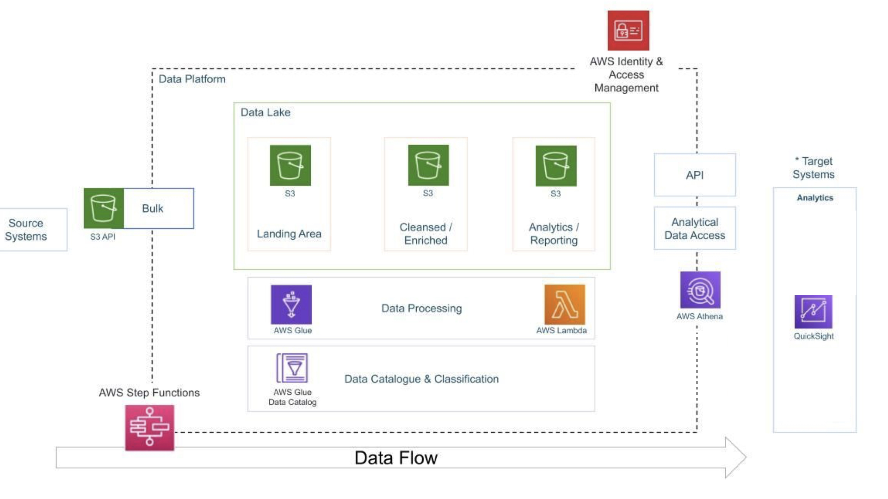

# AWS Data Engineering Pipeline to perform Analytics on Youtube data.

## Introduction

The goal of this project is to perform data analytics on Youtube data using various tools and technologies, including **AWS S3 Storage, Python, E2 Compute Instance, AWS Glue, AWS Lambda, Crawler, Athena**, and **AWS QuickSight**.

## Architecture 

## Technology Used
- Programming Language - **Python**
- Data Analytics Language - **SQL**

AWS Platform
1. **Amazon S3**: Amazon S3 is an object storage service that provides manufacturing scalability, data availability, security, and performance.
2. **AWS IAM**: This is nothing but identity and access management which enables us to manage access to AWS services and resources securely.
3. **QuickSight**: Amazon QuickSight is a scalable, serverless, embeddable, machine learning-powered business intelligence (BI) service built for the cloud.
4. **AWS Glue**: A serverless data integration service that makes it easy to discover, prepare, and combine data for analytics, machine learning, and application development.
5. **AWS Lambda**: Lambda is a computing service that allows programmers to run code without creating or managing servers.
6. **AWS Athena**: Athena is an interactive query service for S3 in which there is no need to load data it stays in S3.

## Dataset Used
Youtube Data
This Kaggle dataset contains statistics (CSV files) on daily popular YouTube videos over the course of many months. There are up to 200 trending videos published every day for many locations. The data for each region is in its own file. The video title, channel title, publication time, tags, views, likes and dislikes, description, and comment count are among the items included in the data. A category_id field, which differs by area, is also included in the JSON file linked to the region.

Additional dataset information:
1. Website - https://www.kaggle.com/datasets/datasnaek/youtube-new 

## Data Analytics Dashboard

