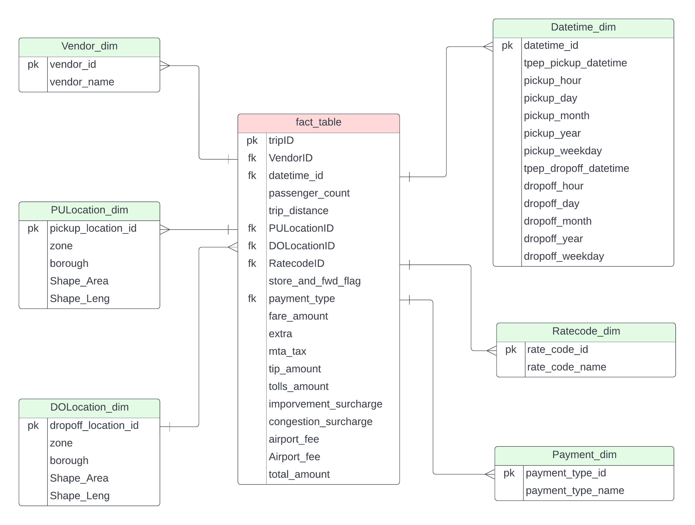
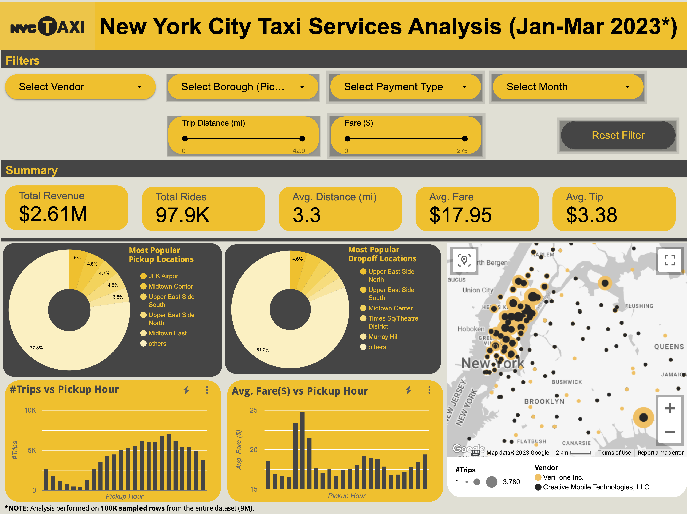

# Google Cloud Data Engineering Pipeline to perform Analytics on New York City (NYC) Tax Service data.

## Introduction

The goal of this project is to perform data analytics on NYC Tax Service data using various tools and technologies, including **GCP Storage, Python, Compute Instance, Mage Data Pipeline Tool, BigQuery**, and **Looker Studio**.

## Architecture 

## Technology Used
- Programming Language - **Python**
- Data Analytics Language - **SQL**

Google Cloud Platform
1. **Google Storage**
2. **Compute Instance** 
3. **BigQuery**
4. **Looker Studio**

**MAGE Data Pipeline** Tool - https://www.mage.ai/

## Dataset Used
NYC Taxi Service Trip Record Data
Yellow taxi trip records include fields capturing pick-up and drop-off dates/times, pick-up and drop-off locations, trip distances, itemized fares, rate types, payment types, and driver-reported passenger counts. 

Additional dataset information:
1. Website - https://www.nyc.gov/site/tlc/about/tlc-trip-record-data.page
2. Data Dictionary - https://www.nyc.gov/assets/tlc/downloads/pdf/data_dictionary_trip_records_yellow.pdf
3. Taxi Zone Data - https://data.cityofnewyork.us/Transportation/NYC-Taxi-Zones/d3c5-ddgc

## Data Model

## Data Analytics Dashboard

