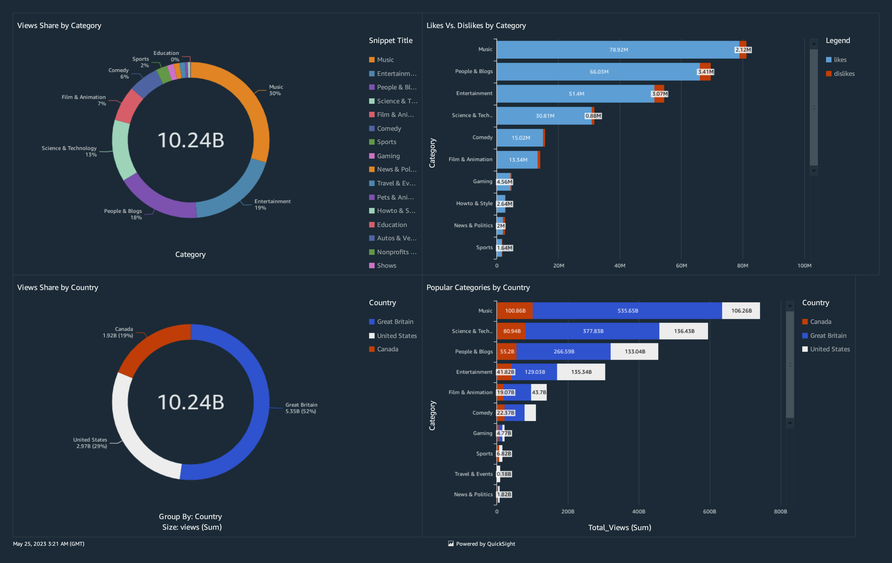

# Complete Data Engineering Pipeline ON AWS (EC2, S3) including Data Cleaning (AWS Lambda function), Data Transformation (AWS Spark ETL Jobs), Database Update (Crawler, Athena) and Data Analysis (AWS QuickSight)

## Tasks Performed:

- Transfer the data to AWS S3 *([bash_file](s3_cli_data_upload.sh))*.

- **Clean the json** reference data files (since raw data is not correctly read by the tables) using **AWS Lambda** to make it database compatible and set the lambda function to auto trigger on any update to the directory *([lamdba_function](lambdaFunc_etl_toExtract_from_json.py))*.

- Transform the **csv records to parquet** using **AWS ETL** job for better performance *([etlJob1](etlJob_script_rawCSV_to_cleanParquet.py))*.

- Update the database and tables using **AWS Crawler**.

- Execute another **AWS ETL** job to **join the record and reference tables** and **create a new table for storing clean analytics data** *([etlJob2](etlJob_script_cleanParquet_toAnalyticsDB.py))*.

- **Extract the necessary data** ([sql](sql_fetching_analytics_data.sql)) using **AWS Athena** and store the information in **AWS QuickSight**.

- **Create a Dashboard** using the data on **AWS QuickSight** *([dashboard](Dataeng_Youtube_Stat_Overview_New.pdf))*.

