# Customer Segmentation using Unsupervised Learning (Python)

##### The data for this project was downloaded from "https://www.kaggle.com/datasets/mosesmoncy/mall-customerscsv".

## IMPORT LIBRARIES 


```python
import pandas as pd
import numpy as np
import seaborn as sns
import matplotlib.pyplot as plt
from sklearn.cluster import KMeans

import warnings
warnings.filterwarnings('ignore')
```

## READ THE DATA


```python
data = pd.read_csv("Mall_Customers.csv")
```


```python
data.head()
```


<div>
<style scoped>
    .dataframe tbody tr th:only-of-type {
        vertical-align: middle;
    }

    .dataframe tbody tr th {
        vertical-align: top;
    }

    .dataframe thead th {
        text-align: right;
    }
</style>
<table border="1" class="dataframe">
  <thead>
    <tr style="text-align: right;">
      <th></th>
      <th>CustomerID</th>
      <th>Gender</th>
      <th>Age</th>
      <th>Annual Income (k$)</th>
      <th>Spending Score (1-100)</th>
    </tr>
  </thead>
  <tbody>
    <tr>
      <th>0</th>
      <td>1</td>
      <td>Male</td>
      <td>19</td>
      <td>15</td>
      <td>39</td>
    </tr>
    <tr>
      <th>1</th>
      <td>2</td>
      <td>Male</td>
      <td>21</td>
      <td>15</td>
      <td>81</td>
    </tr>
    <tr>
      <th>2</th>
      <td>3</td>
      <td>Female</td>
      <td>20</td>
      <td>16</td>
      <td>6</td>
    </tr>
    <tr>
      <th>3</th>
      <td>4</td>
      <td>Female</td>
      <td>23</td>
      <td>16</td>
      <td>77</td>
    </tr>
    <tr>
      <th>4</th>
      <td>5</td>
      <td>Female</td>
      <td>31</td>
      <td>17</td>
      <td>40</td>
    </tr>
  </tbody>
</table>
</div>


## UNIVARIATE ANALYSIS


```python
data.describe()
```


<div>
<style scoped>
    .dataframe tbody tr th:only-of-type {
        vertical-align: middle;
    }

    .dataframe tbody tr th {
        vertical-align: top;
    }

    .dataframe thead th {
        text-align: right;
    }
</style>
<table border="1" class="dataframe">
  <thead>
    <tr style="text-align: right;">
      <th></th>
      <th>CustomerID</th>
      <th>Age</th>
      <th>Annual Income (k$)</th>
      <th>Spending Score (1-100)</th>
    </tr>
  </thead>
  <tbody>
    <tr>
      <th>count</th>
      <td>200.000000</td>
      <td>200.000000</td>
      <td>200.000000</td>
      <td>200.000000</td>
    </tr>
    <tr>
      <th>mean</th>
      <td>100.500000</td>
      <td>38.850000</td>
      <td>60.560000</td>
      <td>50.200000</td>
    </tr>
    <tr>
      <th>std</th>
      <td>57.879185</td>
      <td>13.969007</td>
      <td>26.264721</td>
      <td>25.823522</td>
    </tr>
    <tr>
      <th>min</th>
      <td>1.000000</td>
      <td>18.000000</td>
      <td>15.000000</td>
      <td>1.000000</td>
    </tr>
    <tr>
      <th>25%</th>
      <td>50.750000</td>
      <td>28.750000</td>
      <td>41.500000</td>
      <td>34.750000</td>
    </tr>
    <tr>
      <th>50%</th>
      <td>100.500000</td>
      <td>36.000000</td>
      <td>61.500000</td>
      <td>50.000000</td>
    </tr>
    <tr>
      <th>75%</th>
      <td>150.250000</td>
      <td>49.000000</td>
      <td>78.000000</td>
      <td>73.000000</td>
    </tr>
    <tr>
      <th>max</th>
      <td>200.000000</td>
      <td>70.000000</td>
      <td>137.000000</td>
      <td>99.000000</td>
    </tr>
  </tbody>
</table>
</div>


### Distribution of the Numeric Columns


```python
for col in list(data.columns):
    if col == 'CustomerID' or data[col].dtype == 'object':
        continue
    plt.figure()
    sns.distplot(data[col]);
```


    
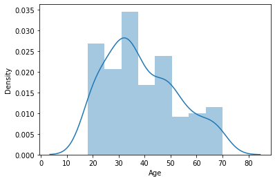
    


    
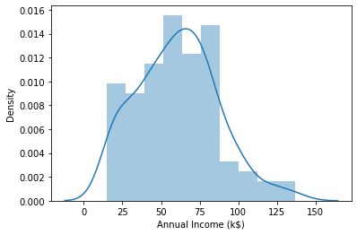
    


    
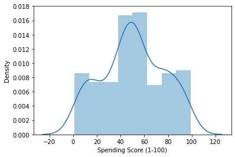
    


### Distribution of the Numeric Columns by Gender


```python
for col in list(data.columns):
    if col == 'CustomerID' or data[col].dtype == 'object':
        continue
    plt.figure()
    sns.kdeplot(data[col], shade=True, hue=data['Gender']);
```


    
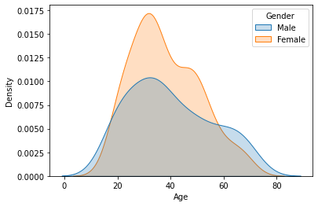
    


    
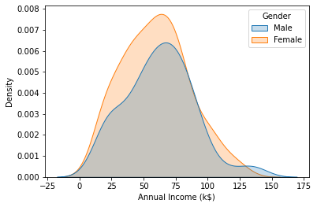
    


    
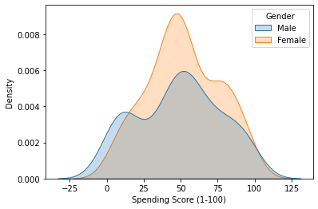
    


### Box Plots for Numeric Columns by Gender


```python
for col in list(data.columns):
    if col == 'CustomerID' or data[col].dtype == 'object':
        continue
    plt.figure()
    sns.boxplot(data=data, x=data['Gender'], y=data[col]);
```


    
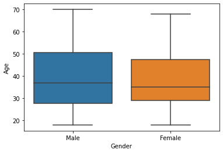
    


    
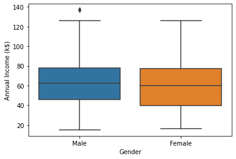
    


    
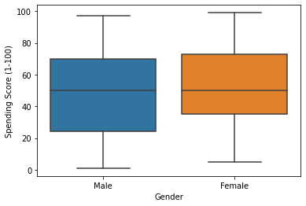
    


### Percentage of Data by Gender


```python
data['Gender'].value_counts(normalize=True)
```


    Female    0.56
    Male      0.44
    Name: Gender, dtype: float64


## BIVARIATE ANALYSIS

##### Remove irrelevant columns ('CustomerID')


```python
data_new = data.drop('CustomerID', axis=1)
```

### Pairplot between the Numerical columns by Gender


```python
sns.pairplot(data_new, hue='Gender');
```


    
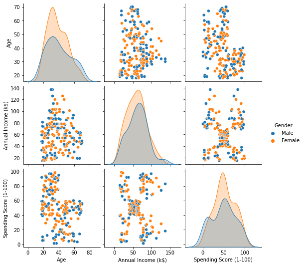
    


#### Aggregate Information by Gender


```python
data.groupby(['Gender']).agg({'CustomerID':'count','Age':'mean', 'Annual Income (k$)':'mean', 'Spending Score (1-100)':'mean'})
```


<div>
<style scoped>
    .dataframe tbody tr th:only-of-type {
        vertical-align: middle;
    }

    .dataframe tbody tr th {
        vertical-align: top;
    }

    .dataframe thead th {
        text-align: right;
    }
</style>
<table border="1" class="dataframe">
  <thead>
    <tr style="text-align: right;">
      <th></th>
      <th>CustomerID</th>
      <th>Age</th>
      <th>Annual Income (k$)</th>
      <th>Spending Score (1-100)</th>
    </tr>
    <tr>
      <th>Gender</th>
      <th></th>
      <th></th>
      <th></th>
      <th></th>
    </tr>
  </thead>
  <tbody>
    <tr>
      <th>Female</th>
      <td>112</td>
      <td>38.098214</td>
      <td>59.250000</td>
      <td>51.526786</td>
    </tr>
    <tr>
      <th>Male</th>
      <td>88</td>
      <td>39.806818</td>
      <td>62.227273</td>
      <td>48.511364</td>
    </tr>
  </tbody>
</table>
</div>


### Data Correlation


```python
data_new.corr()
```


<div>
<style scoped>
    .dataframe tbody tr th:only-of-type {
        vertical-align: middle;
    }

    .dataframe tbody tr th {
        vertical-align: top;
    }

    .dataframe thead th {
        text-align: right;
    }
</style>
<table border="1" class="dataframe">
  <thead>
    <tr style="text-align: right;">
      <th></th>
      <th>Age</th>
      <th>Annual Income (k$)</th>
      <th>Spending Score (1-100)</th>
    </tr>
  </thead>
  <tbody>
    <tr>
      <th>Age</th>
      <td>1.000000</td>
      <td>-0.012398</td>
      <td>-0.327227</td>
    </tr>
    <tr>
      <th>Annual Income (k$)</th>
      <td>-0.012398</td>
      <td>1.000000</td>
      <td>0.009903</td>
    </tr>
    <tr>
      <th>Spending Score (1-100)</th>
      <td>-0.327227</td>
      <td>0.009903</td>
      <td>1.000000</td>
    </tr>
  </tbody>
</table>
</div>


```python
sns.heatmap(data_new.corr(), annot=True, cmap='coolwarm');
```


    
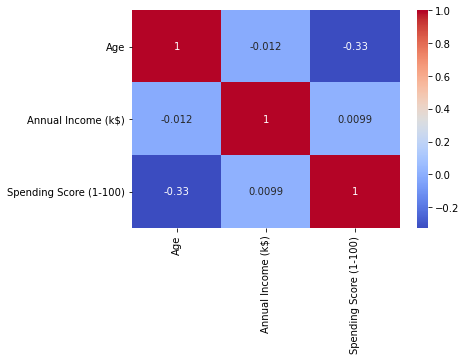
    


## DATA CLUSTERING

## Univariate Clustering


```python
clu1 = KMeans()
```


```python
clu1.fit(data[['Annual Income (k$)']])
```


    KMeans()


```python
clu1.labels_
```


    array([7, 7, 7, 7, 7, 7, 7, 7, 7, 7, 7, 7, 7, 7, 7, 7, 7, 7, 7, 7, 7, 7,
           7, 7, 3, 3, 3, 3, 3, 3, 3, 3, 3, 3, 3, 3, 3, 3, 3, 3, 3, 3, 3, 3,
           3, 3, 3, 3, 3, 3, 1, 1, 1, 1, 1, 1, 1, 1, 1, 1, 1, 1, 1, 1, 1, 1,
           1, 1, 1, 1, 1, 1, 1, 1, 1, 1, 1, 1, 1, 1, 1, 1, 1, 1, 1, 1, 5, 5,
           5, 5, 5, 5, 5, 5, 5, 5, 5, 5, 5, 5, 5, 5, 5, 5, 5, 5, 5, 5, 5, 5,
           5, 5, 5, 5, 5, 5, 5, 5, 5, 5, 5, 5, 2, 2, 2, 2, 2, 2, 2, 2, 2, 2,
           2, 2, 2, 2, 2, 2, 2, 2, 2, 2, 2, 2, 2, 2, 2, 2, 2, 2, 2, 2, 2, 2,
           2, 2, 2, 2, 2, 2, 2, 2, 6, 6, 6, 6, 6, 6, 6, 6, 6, 6, 6, 6, 6, 6,
           6, 6, 6, 6, 0, 0, 0, 0, 0, 0, 0, 0, 0, 0, 0, 0, 0, 0, 4, 4, 4, 4,
           4, 4], dtype=int32)


```python
data['AnnualIncome_Cluster'] = clu1.labels_
```


```python
data.head()
```


<div>
<style scoped>
    .dataframe tbody tr th:only-of-type {
        vertical-align: middle;
    }

    .dataframe tbody tr th {
        vertical-align: top;
    }

    .dataframe thead th {
        text-align: right;
    }
</style>
<table border="1" class="dataframe">
  <thead>
    <tr style="text-align: right;">
      <th></th>
      <th>CustomerID</th>
      <th>Gender</th>
      <th>Age</th>
      <th>Annual Income (k$)</th>
      <th>Spending Score (1-100)</th>
      <th>AnnualIncome_Cluster</th>
    </tr>
  </thead>
  <tbody>
    <tr>
      <th>0</th>
      <td>1</td>
      <td>Male</td>
      <td>19</td>
      <td>15</td>
      <td>39</td>
      <td>7</td>
    </tr>
    <tr>
      <th>1</th>
      <td>2</td>
      <td>Male</td>
      <td>21</td>
      <td>15</td>
      <td>81</td>
      <td>7</td>
    </tr>
    <tr>
      <th>2</th>
      <td>3</td>
      <td>Female</td>
      <td>20</td>
      <td>16</td>
      <td>6</td>
      <td>7</td>
    </tr>
    <tr>
      <th>3</th>
      <td>4</td>
      <td>Female</td>
      <td>23</td>
      <td>16</td>
      <td>77</td>
      <td>7</td>
    </tr>
    <tr>
      <th>4</th>
      <td>5</td>
      <td>Female</td>
      <td>31</td>
      <td>17</td>
      <td>40</td>
      <td>7</td>
    </tr>
  </tbody>
</table>
</div>


```python
data['AnnualIncome_Cluster'].value_counts(normalize=True)
```


    2    0.20
    5    0.18
    1    0.18
    3    0.13
    7    0.12
    6    0.09
    0    0.07
    4    0.03
    Name: AnnualIncome_Cluster, dtype: float64


```python
clu1.inertia_
```


    2862.250427350428


### Determine the best number of clusters using the clustering inertia (Elbow method)


```python
inertias = {}
for i in range(1, 11):
    clu = KMeans(n_clusters=i)
    clu.fit(data[['Annual Income (k$)']])
    inertias[i] = clu.inertia_
inertias
```


    {1: 137277.2800000002,
     2: 48660.88888888887,
     3: 23528.152173913048,
     4: 13278.112713472474,
     5: 8481.49619047619,
     6: 5050.904761904766,
     7: 3931.9880952380995,
     8: 2857.4416971916967,
     9: 2190.0972210795735,
     10: 1734.167748917749}


```python
sns.lineplot(x=list(inertias.keys()), y=list(inertias.values()), color='r', marker='s');
```


    
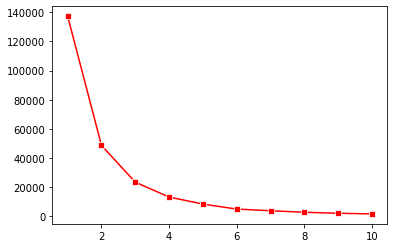
    


### Based on the elbow method, when 'n_clusters=3', we see the elbow


```python
clu2 = KMeans(n_clusters=3)
clu2.fit(data[['Annual Income (k$)']])
data['AnnualIncome_Cluster'] = clu2.labels_
```


```python
data.groupby('AnnualIncome_Cluster')['Age', 'Annual Income (k$)', 'Spending Score (1-100)'].mean()
```


<div>
<style scoped>
    .dataframe tbody tr th:only-of-type {
        vertical-align: middle;
    }

    .dataframe tbody tr th {
        vertical-align: top;
    }

    .dataframe thead th {
        text-align: right;
    }
</style>
<table border="1" class="dataframe">
  <thead>
    <tr style="text-align: right;">
      <th></th>
      <th>Age</th>
      <th>Annual Income (k$)</th>
      <th>Spending Score (1-100)</th>
    </tr>
    <tr>
      <th>AnnualIncome_Cluster</th>
      <th></th>
      <th></th>
      <th></th>
    </tr>
  </thead>
  <tbody>
    <tr>
      <th>0</th>
      <td>39.500000</td>
      <td>33.486486</td>
      <td>50.229730</td>
    </tr>
    <tr>
      <th>1</th>
      <td>37.833333</td>
      <td>99.888889</td>
      <td>50.638889</td>
    </tr>
    <tr>
      <th>2</th>
      <td>38.722222</td>
      <td>67.088889</td>
      <td>50.000000</td>
    </tr>
  </tbody>
</table>
</div>


## Bivariate Clustering


```python
clu3 = KMeans()
clu3.fit(data[['Annual Income (k$)', 'Spending Score (1-100)']])

data['Income_Spending_Cluster'] = clu3.labels_
```


```python
data.head()
```


<div>
<style scoped>
    .dataframe tbody tr th:only-of-type {
        vertical-align: middle;
    }

    .dataframe tbody tr th {
        vertical-align: top;
    }

    .dataframe thead th {
        text-align: right;
    }
</style>
<table border="1" class="dataframe">
  <thead>
    <tr style="text-align: right;">
      <th></th>
      <th>CustomerID</th>
      <th>Gender</th>
      <th>Age</th>
      <th>Annual Income (k$)</th>
      <th>Spending Score (1-100)</th>
      <th>AnnualIncome_Cluster</th>
      <th>Income_Spending_Cluster</th>
    </tr>
  </thead>
  <tbody>
    <tr>
      <th>0</th>
      <td>1</td>
      <td>Male</td>
      <td>19</td>
      <td>15</td>
      <td>39</td>
      <td>0</td>
      <td>1</td>
    </tr>
    <tr>
      <th>1</th>
      <td>2</td>
      <td>Male</td>
      <td>21</td>
      <td>15</td>
      <td>81</td>
      <td>0</td>
      <td>3</td>
    </tr>
    <tr>
      <th>2</th>
      <td>3</td>
      <td>Female</td>
      <td>20</td>
      <td>16</td>
      <td>6</td>
      <td>0</td>
      <td>1</td>
    </tr>
    <tr>
      <th>3</th>
      <td>4</td>
      <td>Female</td>
      <td>23</td>
      <td>16</td>
      <td>77</td>
      <td>0</td>
      <td>3</td>
    </tr>
    <tr>
      <th>4</th>
      <td>5</td>
      <td>Female</td>
      <td>31</td>
      <td>17</td>
      <td>40</td>
      <td>0</td>
      <td>1</td>
    </tr>
  </tbody>
</table>
</div>


### Determine the best number of clusters using the clustering inertia (Elbow method)


```python
inertias2 = {}
for i in range(1, 11):
    clu = KMeans(n_clusters=i)
    clu.fit(data[['Annual Income (k$)', 'Spending Score (1-100)']])
    inertias2[i] = clu.inertia_

inertias2

sns.lineplot(x=list(inertias2.keys()), y=list(inertias2.values()), color='g', marker='o');
```


    
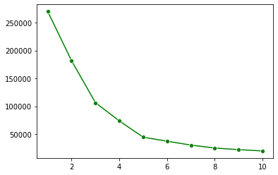
    


### Based on the elbow method, when 'n_clusters=5', we see the elbow


```python
clu4 = KMeans(n_clusters=5)
clu4.fit(data[['Annual Income (k$)', 'Spending Score (1-100)']])

data['Income_Spending_Cluster'] = clu4.labels_
```

### Observe the cluster elements on the scatter plot (Annual Income Vs. Spending Score)


```python
# Obtain the Cluster centers
centers = pd.DataFrame(clu4.cluster_centers_)
centers.columns = ['x', 'y']

plt.figure(figsize=(10, 8))

#Mark the cluster centers
sns.scatterplot( x=centers['x'], y=centers['y'], marker='*', color='k', s=250)

plt.xlabel('Annual Income (k$)');
plt.ylabel('Spending Score (1-100)');

# Plot all points
plot = sns.scatterplot(data=data, x='Annual Income (k$)', y='Spending Score (1-100)', hue='Income_Spending_Cluster', style='Income_Spending_Cluster', palette='tab10', s=50);
```


    
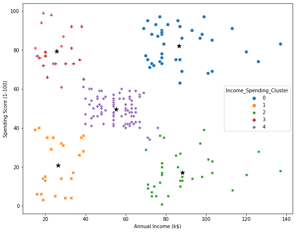
    


### Determine the average age of each cluster


```python
data.groupby('Income_Spending_Cluster').agg({'Age':'mean', 'Annual Income (k$)':'mean', 'Spending Score (1-100)':'mean'})
```


<div>
<style scoped>
    .dataframe tbody tr th:only-of-type {
        vertical-align: middle;
    }

    .dataframe tbody tr th {
        vertical-align: top;
    }

    .dataframe thead th {
        text-align: right;
    }
</style>
<table border="1" class="dataframe">
  <thead>
    <tr style="text-align: right;">
      <th></th>
      <th>Age</th>
      <th>Annual Income (k$)</th>
      <th>Spending Score (1-100)</th>
    </tr>
    <tr>
      <th>Income_Spending_Cluster</th>
      <th></th>
      <th></th>
      <th></th>
    </tr>
  </thead>
  <tbody>
    <tr>
      <th>0</th>
      <td>32.692308</td>
      <td>86.538462</td>
      <td>82.128205</td>
    </tr>
    <tr>
      <th>1</th>
      <td>45.217391</td>
      <td>26.304348</td>
      <td>20.913043</td>
    </tr>
    <tr>
      <th>2</th>
      <td>41.114286</td>
      <td>88.200000</td>
      <td>17.114286</td>
    </tr>
    <tr>
      <th>3</th>
      <td>25.272727</td>
      <td>25.727273</td>
      <td>79.363636</td>
    </tr>
    <tr>
      <th>4</th>
      <td>42.716049</td>
      <td>55.296296</td>
      <td>49.518519</td>
    </tr>
  </tbody>
</table>
</div>


### Determine the cluster ratio by Gender


```python
pd.crosstab(data['Income_Spending_Cluster'], data['Gender'], normalize='index')
```


<div>
<style scoped>
    .dataframe tbody tr th:only-of-type {
        vertical-align: middle;
    }

    .dataframe tbody tr th {
        vertical-align: top;
    }

    .dataframe thead th {
        text-align: right;
    }
</style>
<table border="1" class="dataframe">
  <thead>
    <tr style="text-align: right;">
      <th>Gender</th>
      <th>Female</th>
      <th>Male</th>
    </tr>
    <tr>
      <th>Income_Spending_Cluster</th>
      <th></th>
      <th></th>
    </tr>
  </thead>
  <tbody>
    <tr>
      <th>0</th>
      <td>0.538462</td>
      <td>0.461538</td>
    </tr>
    <tr>
      <th>1</th>
      <td>0.608696</td>
      <td>0.391304</td>
    </tr>
    <tr>
      <th>2</th>
      <td>0.457143</td>
      <td>0.542857</td>
    </tr>
    <tr>
      <th>3</th>
      <td>0.590909</td>
      <td>0.409091</td>
    </tr>
    <tr>
      <th>4</th>
      <td>0.592593</td>
      <td>0.407407</td>
    </tr>
  </tbody>
</table>
</div>


### OBSERVATIONS:
#### - The averge age of the highest spending customer demographic (Cluster 3) is about 32-33 years.
#### - The youngest average demographic (Cluster 1) have low income but have very high spending score.
#### - The oldest demographic (Cluster 4) have low income as well as low spending score.
#### - The highest spending customer demographic belong to Cluster 3 and it comprises of about 54% Female and 46% Male.

## Multivariate Clustering

### Import Necessary Library for Standard Scaling


```python
from sklearn.preprocessing import StandardScaler
```


```python
scale = StandardScaler()
```

### Determine the Dtype of all columns


```python
data.dtypes
```


    CustomerID                  int64
    Gender                     object
    Age                         int64
    Annual Income (k$)          int64
    Spending Score (1-100)      int64
    AnnualIncome_Cluster        int32
    Income_Spending_Cluster     int32
    dtype: object


### Convert the non-numerical columns to numeric dtype


```python
data_numeric = pd.get_dummies(data, drop_first=True)

data_numeric.head()
```


<div>
<style scoped>
    .dataframe tbody tr th:only-of-type {
        vertical-align: middle;
    }

    .dataframe tbody tr th {
        vertical-align: top;
    }

    .dataframe thead th {
        text-align: right;
    }
</style>
<table border="1" class="dataframe">
  <thead>
    <tr style="text-align: right;">
      <th></th>
      <th>CustomerID</th>
      <th>Age</th>
      <th>Annual Income (k$)</th>
      <th>Spending Score (1-100)</th>
      <th>AnnualIncome_Cluster</th>
      <th>Income_Spending_Cluster</th>
      <th>Gender_Male</th>
    </tr>
  </thead>
  <tbody>
    <tr>
      <th>0</th>
      <td>1</td>
      <td>19</td>
      <td>15</td>
      <td>39</td>
      <td>0</td>
      <td>1</td>
      <td>1</td>
    </tr>
    <tr>
      <th>1</th>
      <td>2</td>
      <td>21</td>
      <td>15</td>
      <td>81</td>
      <td>0</td>
      <td>3</td>
      <td>1</td>
    </tr>
    <tr>
      <th>2</th>
      <td>3</td>
      <td>20</td>
      <td>16</td>
      <td>6</td>
      <td>0</td>
      <td>1</td>
      <td>0</td>
    </tr>
    <tr>
      <th>3</th>
      <td>4</td>
      <td>23</td>
      <td>16</td>
      <td>77</td>
      <td>0</td>
      <td>3</td>
      <td>0</td>
    </tr>
    <tr>
      <th>4</th>
      <td>5</td>
      <td>31</td>
      <td>17</td>
      <td>40</td>
      <td>0</td>
      <td>1</td>
      <td>0</td>
    </tr>
  </tbody>
</table>
</div>


### Remove irrelevant columns


```python
data_numeric = data_numeric.drop(['CustomerID', 'AnnualIncome_Cluster', 'Income_Spending_Cluster'], axis=1)

data_numeric.head()
```


<div>
<style scoped>
    .dataframe tbody tr th:only-of-type {
        vertical-align: middle;
    }

    .dataframe tbody tr th {
        vertical-align: top;
    }

    .dataframe thead th {
        text-align: right;
    }
</style>
<table border="1" class="dataframe">
  <thead>
    <tr style="text-align: right;">
      <th></th>
      <th>Age</th>
      <th>Annual Income (k$)</th>
      <th>Spending Score (1-100)</th>
      <th>Gender_Male</th>
    </tr>
  </thead>
  <tbody>
    <tr>
      <th>0</th>
      <td>19</td>
      <td>15</td>
      <td>39</td>
      <td>1</td>
    </tr>
    <tr>
      <th>1</th>
      <td>21</td>
      <td>15</td>
      <td>81</td>
      <td>1</td>
    </tr>
    <tr>
      <th>2</th>
      <td>20</td>
      <td>16</td>
      <td>6</td>
      <td>0</td>
    </tr>
    <tr>
      <th>3</th>
      <td>23</td>
      <td>16</td>
      <td>77</td>
      <td>0</td>
    </tr>
    <tr>
      <th>4</th>
      <td>31</td>
      <td>17</td>
      <td>40</td>
      <td>0</td>
    </tr>
  </tbody>
</table>
</div>


### Scale the dataframe


```python
data_numeric = pd.DataFrame(scale.fit_transform(data_numeric))

data_numeric.head()
```


<div>
<style scoped>
    .dataframe tbody tr th:only-of-type {
        vertical-align: middle;
    }

    .dataframe tbody tr th {
        vertical-align: top;
    }

    .dataframe thead th {
        text-align: right;
    }
</style>
<table border="1" class="dataframe">
  <thead>
    <tr style="text-align: right;">
      <th></th>
      <th>0</th>
      <th>1</th>
      <th>2</th>
      <th>3</th>
    </tr>
  </thead>
  <tbody>
    <tr>
      <th>0</th>
      <td>-1.424569</td>
      <td>-1.738999</td>
      <td>-0.434801</td>
      <td>1.128152</td>
    </tr>
    <tr>
      <th>1</th>
      <td>-1.281035</td>
      <td>-1.738999</td>
      <td>1.195704</td>
      <td>1.128152</td>
    </tr>
    <tr>
      <th>2</th>
      <td>-1.352802</td>
      <td>-1.700830</td>
      <td>-1.715913</td>
      <td>-0.886405</td>
    </tr>
    <tr>
      <th>3</th>
      <td>-1.137502</td>
      <td>-1.700830</td>
      <td>1.040418</td>
      <td>-0.886405</td>
    </tr>
    <tr>
      <th>4</th>
      <td>-0.563369</td>
      <td>-1.662660</td>
      <td>-0.395980</td>
      <td>-0.886405</td>
    </tr>
  </tbody>
</table>
</div>


### Determine the best number of clusters using the clustering inertia (Elbow method)


```python
inertias3 = {}

for i in range(1, 11):
    clu = KMeans(n_clusters=i)
    clu.fit(data_numeric)
    inertias3[i] = clu.inertia_

inertias3

sns.lineplot(x=list(inertias3.keys()), y=list(inertias3.values()), color='m', marker='s');
```


    
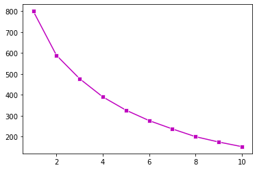
    


### Based on the elbow method, when 'n_clusters=4', we see the slight elbow (not clearly distinguishable)


```python
clu5 = KMeans(n_clusters=4)
clu5.fit(data_numeric)

data['MultiVariate_Cluster'] = clu5.labels_

data.head()
```


<div>
<style scoped>
    .dataframe tbody tr th:only-of-type {
        vertical-align: middle;
    }

    .dataframe tbody tr th {
        vertical-align: top;
    }

    .dataframe thead th {
        text-align: right;
    }
</style>
<table border="1" class="dataframe">
  <thead>
    <tr style="text-align: right;">
      <th></th>
      <th>CustomerID</th>
      <th>Gender</th>
      <th>Age</th>
      <th>Annual Income (k$)</th>
      <th>Spending Score (1-100)</th>
      <th>AnnualIncome_Cluster</th>
      <th>Income_Spending_Cluster</th>
      <th>MultiVariate_Cluster</th>
    </tr>
  </thead>
  <tbody>
    <tr>
      <th>0</th>
      <td>1</td>
      <td>Male</td>
      <td>19</td>
      <td>15</td>
      <td>39</td>
      <td>0</td>
      <td>1</td>
      <td>2</td>
    </tr>
    <tr>
      <th>1</th>
      <td>2</td>
      <td>Male</td>
      <td>21</td>
      <td>15</td>
      <td>81</td>
      <td>0</td>
      <td>3</td>
      <td>2</td>
    </tr>
    <tr>
      <th>2</th>
      <td>3</td>
      <td>Female</td>
      <td>20</td>
      <td>16</td>
      <td>6</td>
      <td>0</td>
      <td>1</td>
      <td>4</td>
    </tr>
    <tr>
      <th>3</th>
      <td>4</td>
      <td>Female</td>
      <td>23</td>
      <td>16</td>
      <td>77</td>
      <td>0</td>
      <td>3</td>
      <td>1</td>
    </tr>
    <tr>
      <th>4</th>
      <td>5</td>
      <td>Female</td>
      <td>31</td>
      <td>17</td>
      <td>40</td>
      <td>0</td>
      <td>1</td>
      <td>4</td>
    </tr>
  </tbody>
</table>
</div>


## ANALYSIS:


```python
# Obtain the Cluster centers
centers = pd.DataFrame(clu4.cluster_centers_)
centers.columns = ['x', 'y']

plt.figure(figsize=(10, 8))

#Mark the cluster centers
sns.scatterplot( x=centers['x'], y=centers['y'], marker='*', color='k', s=250)

plt.xlabel('Annual Income (k$)');
plt.ylabel('Spending Score (1-100)');

# Plot all points
plot = sns.scatterplot(data=data, x='Annual Income (k$)', y='Spending Score (1-100)', hue='Income_Spending_Cluster', style='Income_Spending_Cluster', palette='tab10', s=50);
```


    

    


### - The highest spending customer demographic is Cluster 0.


```python
data.groupby('Income_Spending_Cluster').agg({'Age':'mean', 'Annual Income (k$)':'mean', 'Spending Score (1-100)':'mean'})
```


<div>
<style scoped>
    .dataframe tbody tr th:only-of-type {
        vertical-align: middle;
    }

    .dataframe tbody tr th {
        vertical-align: top;
    }

    .dataframe thead th {
        text-align: right;
    }
</style>
<table border="1" class="dataframe">
  <thead>
    <tr style="text-align: right;">
      <th></th>
      <th>Age</th>
      <th>Annual Income (k$)</th>
      <th>Spending Score (1-100)</th>
    </tr>
    <tr>
      <th>Income_Spending_Cluster</th>
      <th></th>
      <th></th>
      <th></th>
    </tr>
  </thead>
  <tbody>
    <tr>
      <th>0</th>
      <td>32.692308</td>
      <td>86.538462</td>
      <td>82.128205</td>
    </tr>
    <tr>
      <th>1</th>
      <td>45.217391</td>
      <td>26.304348</td>
      <td>20.913043</td>
    </tr>
    <tr>
      <th>2</th>
      <td>41.114286</td>
      <td>88.200000</td>
      <td>17.114286</td>
    </tr>
    <tr>
      <th>3</th>
      <td>25.272727</td>
      <td>25.727273</td>
      <td>79.363636</td>
    </tr>
    <tr>
      <th>4</th>
      <td>42.716049</td>
      <td>55.296296</td>
      <td>49.518519</td>
    </tr>
  </tbody>
</table>
</div>


### - The averge age of the HIGHEST SPENDING customer demographic (Cluster 0) is about 32-33 years.
### - The youngest demographic (Cluster 3) have LOW INCOME but have VERY HIGH SPENDING score.
### - The oldest demographic (Cluster 1) have LOW INCOME as well as LOW SPENDING score.


```python
pd.crosstab(data['Income_Spending_Cluster'], data['Gender'], normalize='index')
```


<div>
<style scoped>
    .dataframe tbody tr th:only-of-type {
        vertical-align: middle;
    }

    .dataframe tbody tr th {
        vertical-align: top;
    }

    .dataframe thead th {
        text-align: right;
    }
</style>
<table border="1" class="dataframe">
  <thead>
    <tr style="text-align: right;">
      <th>Gender</th>
      <th>Female</th>
      <th>Male</th>
    </tr>
    <tr>
      <th>Income_Spending_Cluster</th>
      <th></th>
      <th></th>
    </tr>
  </thead>
  <tbody>
    <tr>
      <th>0</th>
      <td>0.538462</td>
      <td>0.461538</td>
    </tr>
    <tr>
      <th>1</th>
      <td>0.608696</td>
      <td>0.391304</td>
    </tr>
    <tr>
      <th>2</th>
      <td>0.457143</td>
      <td>0.542857</td>
    </tr>
    <tr>
      <th>3</th>
      <td>0.590909</td>
      <td>0.409091</td>
    </tr>
    <tr>
      <th>4</th>
      <td>0.592593</td>
      <td>0.407407</td>
    </tr>
  </tbody>
</table>
</div>


### - The highest spending customer demographic (Cluster 0) comprises of about 54% Female and 46% Male.

## SUGGESTIONS

## Suggestion 1

### - Cluster 0 should be the primary target group due to their HIGH INCOME and HIGH SPENDING score.
### - Since 54% of Cluster 0 are female, the promotional campaign should be designed accordingly.

## Suggestion 2

### - Cluster 3 should be the secondary target group due to their HIGH SPENDING score.

### Since Cluster 3 demographic have LOW INCOME, the promotional camplaign should prioritize LOW-COST Discounted Items or Sale events.
