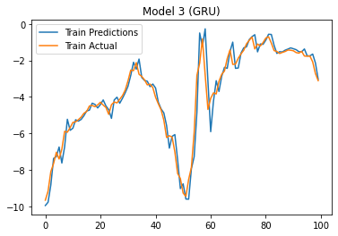

# TIME SERIES TEMPERATURE FORECASTING USING LSTM, Conv1D and GRU.

### IMPORT LIBRARIES


```python
import tensorflow as tf
import os
import pandas as pd
import numpy as np

import warnings
warnings.filterwarnings("ignore")

import logging
logging.getLogger().setLevel(logging.ERROR)
```

### LOAD DATA


```python
zip_path = tf.keras.utils.get_file(
    origin='https://storage.googleapis.com/tensorflow/tf-keras-datasets/jena_climate_2009_2016.csv.zip',
    fname='jena_climate_2009_2016.csv.zip',
    extract=True)

csv_path, _ = os.path.splitext(zip_path)
```


```python
data = pd.read_csv(csv_path)

data.head()
```


<div>
<style scoped>
    .dataframe tbody tr th:only-of-type {
        vertical-align: middle;
    }

    <!-- <!-- .dataframe tbody tr th {
        vertical-align: top;
    }

    .dataframe thead th {
        text-align: right;
    } --> -->
</style>
<table border="1" class="dataframe">
  <thead>
    <tr style="text-align: right;">
      <th></th>
      <th>Date Time</th>
      <th>p (mbar)</th>
      <th>T (degC)</th>
      <th>Tpot (K)</th>
      <th>Tdew (degC)</th>
      <th>rh (%)</th>
      <th>VPmax (mbar)</th>
      <th>VPact (mbar)</th>
      <th>VPdef (mbar)</th>
      <th>sh (g/kg)</th>
      <th>H2OC (mmol/mol)</th>
      <th>rho (g/m**3)</th>
      <th>wv (m/s)</th>
      <th>max. wv (m/s)</th>
      <th>wd (deg)</th>
    </tr>
  </thead>
  <tbody>
    <tr>
      <th>0</th>
      <td>01.01.2009 00:10:00</td>
      <td>996.52</td>
      <td>-8.02</td>
      <td>265.40</td>
      <td>-8.90</td>
      <td>93.3</td>
      <td>3.33</td>
      <td>3.11</td>
      <td>0.22</td>
      <td>1.94</td>
      <td>3.12</td>
      <td>1307.75</td>
      <td>1.03</td>
      <td>1.75</td>
      <td>152.3</td>
    </tr>
    <tr>
      <th>1</th>
      <td>01.01.2009 00:20:00</td>
      <td>996.57</td>
      <td>-8.41</td>
      <td>265.01</td>
      <td>-9.28</td>
      <td>93.4</td>
      <td>3.23</td>
      <td>3.02</td>
      <td>0.21</td>
      <td>1.89</td>
      <td>3.03</td>
      <td>1309.80</td>
      <td>0.72</td>
      <td>1.50</td>
      <td>136.1</td>
    </tr>
    <tr>
      <th>2</th>
      <td>01.01.2009 00:30:00</td>
      <td>996.53</td>
      <td>-8.51</td>
      <td>264.91</td>
      <td>-9.31</td>
      <td>93.9</td>
      <td>3.21</td>
      <td>3.01</td>
      <td>0.20</td>
      <td>1.88</td>
      <td>3.02</td>
      <td>1310.24</td>
      <td>0.19</td>
      <td>0.63</td>
      <td>171.6</td>
    </tr>
    <tr>
      <th>3</th>
      <td>01.01.2009 00:40:00</td>
      <td>996.51</td>
      <td>-8.31</td>
      <td>265.12</td>
      <td>-9.07</td>
      <td>94.2</td>
      <td>3.26</td>
      <td>3.07</td>
      <td>0.19</td>
      <td>1.92</td>
      <td>3.08</td>
      <td>1309.19</td>
      <td>0.34</td>
      <td>0.50</td>
      <td>198.0</td>
    </tr>
    <tr>
      <th>4</th>
      <td>01.01.2009 00:50:00</td>
      <td>996.51</td>
      <td>-8.27</td>
      <td>265.15</td>
      <td>-9.04</td>
      <td>94.1</td>
      <td>3.27</td>
      <td>3.08</td>
      <td>0.19</td>
      <td>1.92</td>
      <td>3.09</td>
      <td>1309.00</td>
      <td>0.32</td>
      <td>0.63</td>
      <td>214.3</td>
    </tr>
  </tbody>
</table>
</div>


#### EXTRACTING THE NECESSARY DATA (EVERY HOURLY DATA)


```python
data = data[5::6] 

data.head()
```


<div>

<table border="1" class="dataframe">
  <thead>
    <tr style="text-align: right;">
      <th></th>
      <th>Date Time</th>
      <th>p (mbar)</th>
      <th>T (degC)</th>
      <th>Tpot (K)</th>
      <th>Tdew (degC)</th>
      <th>rh (%)</th>
      <th>VPmax (mbar)</th>
      <th>VPact (mbar)</th>
      <th>VPdef (mbar)</th>
      <th>sh (g/kg)</th>
      <th>H2OC (mmol/mol)</th>
      <th>rho (g/m**3)</th>
      <th>wv (m/s)</th>
      <th>max. wv (m/s)</th>
      <th>wd (deg)</th>
    </tr>
  </thead>
  <tbody>
    <tr>
      <th>5</th>
      <td>01.01.2009 01:00:00</td>
      <td>996.50</td>
      <td>-8.05</td>
      <td>265.38</td>
      <td>-8.78</td>
      <td>94.4</td>
      <td>3.33</td>
      <td>3.14</td>
      <td>0.19</td>
      <td>1.96</td>
      <td>3.15</td>
      <td>1307.86</td>
      <td>0.21</td>
      <td>0.63</td>
      <td>192.7</td>
    </tr>
    <tr>
      <th>11</th>
      <td>01.01.2009 02:00:00</td>
      <td>996.62</td>
      <td>-8.88</td>
      <td>264.54</td>
      <td>-9.77</td>
      <td>93.2</td>
      <td>3.12</td>
      <td>2.90</td>
      <td>0.21</td>
      <td>1.81</td>
      <td>2.91</td>
      <td>1312.25</td>
      <td>0.25</td>
      <td>0.63</td>
      <td>190.3</td>
    </tr>
    <tr>
      <th>17</th>
      <td>01.01.2009 03:00:00</td>
      <td>996.84</td>
      <td>-8.81</td>
      <td>264.59</td>
      <td>-9.66</td>
      <td>93.5</td>
      <td>3.13</td>
      <td>2.93</td>
      <td>0.20</td>
      <td>1.83</td>
      <td>2.94</td>
      <td>1312.18</td>
      <td>0.18</td>
      <td>0.63</td>
      <td>167.2</td>
    </tr>
    <tr>
      <th>23</th>
      <td>01.01.2009 04:00:00</td>
      <td>996.99</td>
      <td>-9.05</td>
      <td>264.34</td>
      <td>-10.02</td>
      <td>92.6</td>
      <td>3.07</td>
      <td>2.85</td>
      <td>0.23</td>
      <td>1.78</td>
      <td>2.85</td>
      <td>1313.61</td>
      <td>0.10</td>
      <td>0.38</td>
      <td>240.0</td>
    </tr>
    <tr>
      <th>29</th>
      <td>01.01.2009 05:00:00</td>
      <td>997.46</td>
      <td>-9.63</td>
      <td>263.72</td>
      <td>-10.65</td>
      <td>92.2</td>
      <td>2.94</td>
      <td>2.71</td>
      <td>0.23</td>
      <td>1.69</td>
      <td>2.71</td>
      <td>1317.19</td>
      <td>0.40</td>
      <td>0.88</td>
      <td>157.0</td>
    </tr>
  </tbody>
</table>
</div>


```python
data.index = pd.to_datetime(data['Date Time'], format='%d.%m.%Y %H:%M:%S')

data.head()
```


<div>
<style scoped>
    .dataframe tbody tr th:only-of-type {
        vertical-align: middle;
    }

    <!-- .dataframe tbody tr th {
        vertical-align: top;
    }

    .dataframe thead th {
        text-align: right;
    } -->
</style>
<table border="1" class="dataframe">
  <thead>
    <tr style="text-align: right;">
      <th></th>
      <th>Date Time</th>
      <th>p (mbar)</th>
      <th>T (degC)</th>
      <th>Tpot (K)</th>
      <th>Tdew (degC)</th>
      <th>rh (%)</th>
      <th>VPmax (mbar)</th>
      <th>VPact (mbar)</th>
      <th>VPdef (mbar)</th>
      <th>sh (g/kg)</th>
      <th>H2OC (mmol/mol)</th>
      <th>rho (g/m**3)</th>
      <th>wv (m/s)</th>
      <th>max. wv (m/s)</th>
      <th>wd (deg)</th>
    </tr>
    <tr>
      <th>Date Time</th>
      <th></th>
      <th></th>
      <th></th>
      <th></th>
      <th></th>
      <th></th>
      <th></th>
      <th></th>
      <th></th>
      <th></th>
      <th></th>
      <th></th>
      <th></th>
      <th></th>
      <th></th>
    </tr>
  </thead>
  <tbody>
    <tr>
      <th>2009-01-01 01:00:00</th>
      <td>01.01.2009 01:00:00</td>
      <td>996.50</td>
      <td>-8.05</td>
      <td>265.38</td>
      <td>-8.78</td>
      <td>94.4</td>
      <td>3.33</td>
      <td>3.14</td>
      <td>0.19</td>
      <td>1.96</td>
      <td>3.15</td>
      <td>1307.86</td>
      <td>0.21</td>
      <td>0.63</td>
      <td>192.7</td>
    </tr>
    <tr>
      <th>2009-01-01 02:00:00</th>
      <td>01.01.2009 02:00:00</td>
      <td>996.62</td>
      <td>-8.88</td>
      <td>264.54</td>
      <td>-9.77</td>
      <td>93.2</td>
      <td>3.12</td>
      <td>2.90</td>
      <td>0.21</td>
      <td>1.81</td>
      <td>2.91</td>
      <td>1312.25</td>
      <td>0.25</td>
      <td>0.63</td>
      <td>190.3</td>
    </tr>
    <tr>
      <th>2009-01-01 03:00:00</th>
      <td>01.01.2009 03:00:00</td>
      <td>996.84</td>
      <td>-8.81</td>
      <td>264.59</td>
      <td>-9.66</td>
      <td>93.5</td>
      <td>3.13</td>
      <td>2.93</td>
      <td>0.20</td>
      <td>1.83</td>
      <td>2.94</td>
      <td>1312.18</td>
      <td>0.18</td>
      <td>0.63</td>
      <td>167.2</td>
    </tr>
    <tr>
      <th>2009-01-01 04:00:00</th>
      <td>01.01.2009 04:00:00</td>
      <td>996.99</td>
      <td>-9.05</td>
      <td>264.34</td>
      <td>-10.02</td>
      <td>92.6</td>
      <td>3.07</td>
      <td>2.85</td>
      <td>0.23</td>
      <td>1.78</td>
      <td>2.85</td>
      <td>1313.61</td>
      <td>0.10</td>
      <td>0.38</td>
      <td>240.0</td>
    </tr>
    <tr>
      <th>2009-01-01 05:00:00</th>
      <td>01.01.2009 05:00:00</td>
      <td>997.46</td>
      <td>-9.63</td>
      <td>263.72</td>
      <td>-10.65</td>
      <td>92.2</td>
      <td>2.94</td>
      <td>2.71</td>
      <td>0.23</td>
      <td>1.69</td>
      <td>2.71</td>
      <td>1317.19</td>
      <td>0.40</td>
      <td>0.88</td>
      <td>157.0</td>
    </tr>
  </tbody>
</table>
</div>


```python
temp = data['T (degC)']
temp.plot()
```


    <AxesSubplot:xlabel='Date Time'>


    

    


### DATA TRANSFORM


```python
def data_to_X_y(data, window_size=5):
    data_as_np = data.to_numpy()
    X = []
    y = []
    for i in range(len(data_as_np)-window_size):
        row = [[a] for a in data_as_np[i:i+window_size]]
        X.append(row)

        label = data_as_np[i+window_size]
        y.append(label)
    
    return np.array(X), np.array(y)
```


```python
WINDOW_SIZE = 5

X, y = data_to_X_y(temp, WINDOW_SIZE)
X.shape, y.shape
```


    ((70086, 5, 1), (70086,))


```python
X_train, y_train = X[:60000], y[:60000]
X_val, y_val = X[60000:65000], y[60000:65000]
X_test, y_test = X[65000:], y[65000:]

X_train.shape, y_train.shape, X_val.shape, y_val.shape, X_test.shape, y_test.shape
```


    ((60000, 5, 1), (60000,), (5000, 5, 1), (5000,), (5086, 5, 1), (5086,))


### TRAINING MODEL


```python
from tensorflow.keras.models import Sequential
from tensorflow.keras.layers import *
from tensorflow.keras.callbacks import ModelCheckpoint
from tensorflow.keras.losses import MeanSquaredError
from tensorflow.keras.metrics import RootMeanSquaredError
from tensorflow.keras.optimizers import Adam
```

#### MODEL 1


```python
model1 = Sequential()
model1.add(InputLayer((5, 1)))
model1.add(LSTM(64))
model1.add(Dense(8, 'relu'))
model1.add(Dense(1, 'linear'))

model1.summary()
```

    Model: "sequential"
    _________________________________________________________________
     Layer (type)                Output Shape              Param #   
    =================================================================
     lstm (LSTM)                 (None, 64)                16896     
                                                                     
     dense (Dense)               (None, 8)                 520       
                                                                     
     dense_1 (Dense)             (None, 1)                 9         
                                                                     
    =================================================================
    Total params: 17,425
    Trainable params: 17,425
    Non-trainable params: 0
    _________________________________________________________________


#### MODEL 2 (Using Conv 1D - fewer parameters)


```python
model2 = Sequential()
model2.add(InputLayer((5, 1)))
model2.add(Conv1D(64, kernel_size=2))
model2.add(Flatten())
model2.add(Dense(8, 'relu'))
model2.add(Dense(1, 'linear'))

model2.summary()
```

    Model: "sequential_1"
    _________________________________________________________________
     Layer (type)                Output Shape              Param #   
    =================================================================
     conv1d (Conv1D)             (None, 4, 64)             192       
                                                                     
     flatten (Flatten)           (None, 256)               0         
                                                                     
     dense_2 (Dense)             (None, 8)                 2056      
                                                                     
     dense_3 (Dense)             (None, 1)                 9         
                                                                     
    =================================================================
    Total params: 2,257
    Trainable params: 2,257
    Non-trainable params: 0
    _________________________________________________________________


#### MODEL 3 (using GRU)


```python
model3 = Sequential()
model3.add(InputLayer((5, 1)))
model3.add(GRU(64))
model3.add(Dense(8, 'relu'))
model3.add(Dense(1, 'linear'))

model3.summary()
```

    Model: "sequential_2"
    _________________________________________________________________
     Layer (type)                Output Shape              Param #   
    =================================================================
     gru (GRU)                   (None, 64)                12864     
                                                                     
     dense_4 (Dense)             (None, 8)                 520       
                                                                     
     dense_5 (Dense)             (None, 1)                 9         
                                                                     
    =================================================================
    Total params: 13,393
    Trainable params: 13,393
    Non-trainable params: 0
    _________________________________________________________________


```python
cp = ModelCheckpoint('model1/', save_best_only=True)
model1.compile(loss=MeanSquaredError(), optimizer=Adam(learning_rate=0.0001), metrics=RootMeanSquaredError())
```


```python
model1.fit(X_train, y_train, validation_data=(X_val, y_val), epochs=10, callbacks=[cp])
```

    Epoch 1/10
    1864/1875 [============================>.] - ETA: 0s - loss: 58.8100 - root_mean_squared_error: 7.6688

    WARNING:absl:Found untraced functions such as _update_step_xla, lstm_cell_layer_call_fn, lstm_cell_layer_call_and_return_conditional_losses while saving (showing 3 of 3). These functions will not be directly callable after loading.


    INFO:tensorflow:Assets written to: model1/assets


    INFO:tensorflow:Assets written to: model1/assets


    1875/1875 [==============================] - 20s 9ms/step - loss: 58.5036 - root_mean_squared_error: 7.6488 - val_loss: 2.2193 - val_root_mean_squared_error: 1.4897
    Epoch 2/10
    1856/1875 [============================>.] - ETA: 0s - loss: 3.9521 - root_mean_squared_error: 1.9880

    WARNING:absl:Found untraced functions such as _update_step_xla, lstm_cell_layer_call_fn, lstm_cell_layer_call_and_return_conditional_losses while saving (showing 3 of 3). These functions will not be directly callable after loading.


    INFO:tensorflow:Assets written to: model1/assets


    INFO:tensorflow:Assets written to: model1/assets


    1875/1875 [==============================] - 16s 8ms/step - loss: 3.9335 - root_mean_squared_error: 1.9833 - val_loss: 0.6749 - val_root_mean_squared_error: 0.8215
    Epoch 3/10
    1863/1875 [============================>.] - ETA: 0s - loss: 1.1407 - root_mean_squared_error: 1.0680

    WARNING:absl:Found untraced functions such as _update_step_xla, lstm_cell_layer_call_fn, lstm_cell_layer_call_and_return_conditional_losses while saving (showing 3 of 3). These functions will not be directly callable after loading.


    INFO:tensorflow:Assets written to: model1/assets


    INFO:tensorflow:Assets written to: model1/assets


    1875/1875 [==============================] - 17s 9ms/step - loss: 1.1396 - root_mean_squared_error: 1.0675 - val_loss: 0.5531 - val_root_mean_squared_error: 0.7437
    Epoch 4/10
    1866/1875 [============================>.] - ETA: 0s - loss: 0.7779 - root_mean_squared_error: 0.8820

    WARNING:absl:Found untraced functions such as _update_step_xla, lstm_cell_layer_call_fn, lstm_cell_layer_call_and_return_conditional_losses while saving (showing 3 of 3). These functions will not be directly callable after loading.


    INFO:tensorflow:Assets written to: model1/assets


    INFO:tensorflow:Assets written to: model1/assets


    1875/1875 [==============================] - 17s 9ms/step - loss: 0.7769 - root_mean_squared_error: 0.8814 - val_loss: 0.5417 - val_root_mean_squared_error: 0.7360
    Epoch 5/10
    1861/1875 [============================>.] - ETA: 0s - loss: 0.6943 - root_mean_squared_error: 0.8332

    WARNING:absl:Found untraced functions such as _update_step_xla, lstm_cell_layer_call_fn, lstm_cell_layer_call_and_return_conditional_losses while saving (showing 3 of 3). These functions will not be directly callable after loading.


    INFO:tensorflow:Assets written to: model1/assets


    INFO:tensorflow:Assets written to: model1/assets


    1875/1875 [==============================] - 16s 9ms/step - loss: 0.6943 - root_mean_squared_error: 0.8332 - val_loss: 0.5183 - val_root_mean_squared_error: 0.7199
    Epoch 6/10
    1858/1875 [============================>.] - ETA: 0s - loss: 0.6692 - root_mean_squared_error: 0.8180

    WARNING:absl:Found untraced functions such as _update_step_xla, lstm_cell_layer_call_fn, lstm_cell_layer_call_and_return_conditional_losses while saving (showing 3 of 3). These functions will not be directly callable after loading.


    INFO:tensorflow:Assets written to: model1/assets


    INFO:tensorflow:Assets written to: model1/assets


    1875/1875 [==============================] - 17s 9ms/step - loss: 0.6684 - root_mean_squared_error: 0.8175 - val_loss: 0.5042 - val_root_mean_squared_error: 0.7100
    Epoch 7/10
    1864/1875 [============================>.] - ETA: 0s - loss: 0.6582 - root_mean_squared_error: 0.8113

    WARNING:absl:Found untraced functions such as _update_step_xla, lstm_cell_layer_call_fn, lstm_cell_layer_call_and_return_conditional_losses while saving (showing 3 of 3). These functions will not be directly callable after loading.


    INFO:tensorflow:Assets written to: model1/assets


    INFO:tensorflow:Assets written to: model1/assets


    1875/1875 [==============================] - 16s 9ms/step - loss: 0.6591 - root_mean_squared_error: 0.8118 - val_loss: 0.5041 - val_root_mean_squared_error: 0.7100
    Epoch 8/10
    1870/1875 [============================>.] - ETA: 0s - loss: 0.6539 - root_mean_squared_error: 0.8086

    WARNING:absl:Found untraced functions such as _update_step_xla, lstm_cell_layer_call_fn, lstm_cell_layer_call_and_return_conditional_losses while saving (showing 3 of 3). These functions will not be directly callable after loading.


    INFO:tensorflow:Assets written to: model1/assets


    INFO:tensorflow:Assets written to: model1/assets


    1875/1875 [==============================] - 16s 9ms/step - loss: 0.6532 - root_mean_squared_error: 0.8082 - val_loss: 0.4924 - val_root_mean_squared_error: 0.7017
    Epoch 9/10
    1869/1875 [============================>.] - ETA: 0s - loss: 0.6487 - root_mean_squared_error: 0.8054

    WARNING:absl:Found untraced functions such as _update_step_xla, lstm_cell_layer_call_fn, lstm_cell_layer_call_and_return_conditional_losses while saving (showing 3 of 3). These functions will not be directly callable after loading.


    INFO:tensorflow:Assets written to: model1/assets


    INFO:tensorflow:Assets written to: model1/assets


    1875/1875 [==============================] - 16s 9ms/step - loss: 0.6490 - root_mean_squared_error: 0.8056 - val_loss: 0.4909 - val_root_mean_squared_error: 0.7006
    Epoch 10/10
    1859/1875 [============================>.] - ETA: 0s - loss: 0.6448 - root_mean_squared_error: 0.8030

    WARNING:absl:Found untraced functions such as _update_step_xla, lstm_cell_layer_call_fn, lstm_cell_layer_call_and_return_conditional_losses while saving (showing 3 of 3). These functions will not be directly callable after loading.


    INFO:tensorflow:Assets written to: model1/assets


    INFO:tensorflow:Assets written to: model1/assets


    1875/1875 [==============================] - 16s 9ms/step - loss: 0.6460 - root_mean_squared_error: 0.8038 - val_loss: 0.4876 - val_root_mean_squared_error: 0.6983


    <keras.callbacks.History at 0x7f875883d430>


```python
cp = ModelCheckpoint('model2/', save_best_only=True)
model2.compile(loss=MeanSquaredError(), optimizer=Adam(learning_rate=0.0001), metrics=RootMeanSquaredError())
```


```python
model2.fit(X_train, y_train, validation_data=(X_val, y_val), epochs=10, callbacks=[cp])
```

    Epoch 1/10
    1833/1875 [============================>.] - ETA: 0s - loss: 4.7929 - root_mean_squared_error: 2.1893

    WARNING:absl:Found untraced functions such as _jit_compiled_convolution_op, _update_step_xla while saving (showing 2 of 2). These functions will not be directly callable after loading.


    INFO:tensorflow:Assets written to: model2/assets


    INFO:tensorflow:Assets written to: model2/assets


    1875/1875 [==============================] - 5s 2ms/step - loss: 4.7127 - root_mean_squared_error: 2.1709 - val_loss: 0.9437 - val_root_mean_squared_error: 0.9715
    Epoch 2/10
    1859/1875 [============================>.] - ETA: 0s - loss: 1.0126 - root_mean_squared_error: 1.0063

    WARNING:absl:Found untraced functions such as _jit_compiled_convolution_op, _update_step_xla while saving (showing 2 of 2). These functions will not be directly callable after loading.


    INFO:tensorflow:Assets written to: model2/assets


    INFO:tensorflow:Assets written to: model2/assets


    1875/1875 [==============================] - 4s 2ms/step - loss: 1.0092 - root_mean_squared_error: 1.0046 - val_loss: 0.6291 - val_root_mean_squared_error: 0.7931
    Epoch 3/10
    1842/1875 [============================>.] - ETA: 0s - loss: 0.7504 - root_mean_squared_error: 0.8663

    WARNING:absl:Found untraced functions such as _jit_compiled_convolution_op, _update_step_xla while saving (showing 2 of 2). These functions will not be directly callable after loading.


    INFO:tensorflow:Assets written to: model2/assets


    INFO:tensorflow:Assets written to: model2/assets


    1875/1875 [==============================] - 4s 2ms/step - loss: 0.7504 - root_mean_squared_error: 0.8662 - val_loss: 0.5343 - val_root_mean_squared_error: 0.7310
    Epoch 4/10
    1863/1875 [============================>.] - ETA: 0s - loss: 0.6958 - root_mean_squared_error: 0.8341

    WARNING:absl:Found untraced functions such as _jit_compiled_convolution_op, _update_step_xla while saving (showing 2 of 2). These functions will not be directly callable after loading.


    INFO:tensorflow:Assets written to: model2/assets


    INFO:tensorflow:Assets written to: model2/assets


    1875/1875 [==============================] - 4s 2ms/step - loss: 0.6962 - root_mean_squared_error: 0.8344 - val_loss: 0.5059 - val_root_mean_squared_error: 0.7113
    Epoch 5/10
    1868/1875 [============================>.] - ETA: 0s - loss: 0.6737 - root_mean_squared_error: 0.8208

    WARNING:absl:Found untraced functions such as _jit_compiled_convolution_op, _update_step_xla while saving (showing 2 of 2). These functions will not be directly callable after loading.


    INFO:tensorflow:Assets written to: model2/assets


    INFO:tensorflow:Assets written to: model2/assets


    1875/1875 [==============================] - 4s 2ms/step - loss: 0.6730 - root_mean_squared_error: 0.8204 - val_loss: 0.4976 - val_root_mean_squared_error: 0.7054
    Epoch 6/10
    1852/1875 [============================>.] - ETA: 0s - loss: 0.6621 - root_mean_squared_error: 0.8137

    WARNING:absl:Found untraced functions such as _jit_compiled_convolution_op, _update_step_xla while saving (showing 2 of 2). These functions will not be directly callable after loading.


    INFO:tensorflow:Assets written to: model2/assets


    INFO:tensorflow:Assets written to: model2/assets


    1875/1875 [==============================] - 4s 2ms/step - loss: 0.6626 - root_mean_squared_error: 0.8140 - val_loss: 0.4952 - val_root_mean_squared_error: 0.7037
    Epoch 7/10
    1875/1875 [==============================] - 2s 1ms/step - loss: 0.6582 - root_mean_squared_error: 0.8113 - val_loss: 0.4961 - val_root_mean_squared_error: 0.7043
    Epoch 8/10
    1858/1875 [============================>.] - ETA: 0s - loss: 0.6533 - root_mean_squared_error: 0.8083

    WARNING:absl:Found untraced functions such as _jit_compiled_convolution_op, _update_step_xla while saving (showing 2 of 2). These functions will not be directly callable after loading.


    INFO:tensorflow:Assets written to: model2/assets


    INFO:tensorflow:Assets written to: model2/assets


    1875/1875 [==============================] - 4s 2ms/step - loss: 0.6544 - root_mean_squared_error: 0.8089 - val_loss: 0.4921 - val_root_mean_squared_error: 0.7015
    Epoch 9/10
    1848/1875 [============================>.] - ETA: 0s - loss: 0.6533 - root_mean_squared_error: 0.8083

    WARNING:absl:Found untraced functions such as _jit_compiled_convolution_op, _update_step_xla while saving (showing 2 of 2). These functions will not be directly callable after loading.


    INFO:tensorflow:Assets written to: model2/assets


    INFO:tensorflow:Assets written to: model2/assets


    1875/1875 [==============================] - 4s 2ms/step - loss: 0.6528 - root_mean_squared_error: 0.8080 - val_loss: 0.4851 - val_root_mean_squared_error: 0.6965
    Epoch 10/10
    1875/1875 [==============================] - 2s 1ms/step - loss: 0.6520 - root_mean_squared_error: 0.8074 - val_loss: 0.4987 - val_root_mean_squared_error: 0.7062


    <keras.callbacks.History at 0x7f874580b7c0>


```python
cp = ModelCheckpoint('model3/', save_best_only=True)
model3.compile(loss=MeanSquaredError(), optimizer=Adam(learning_rate=0.0001), metrics=RootMeanSquaredError())
```


```python
model3.fit(X_train, y_train, validation_data=(X_val, y_val), epochs=10, callbacks=[cp])
```

    Epoch 1/10
    1873/1875 [============================>.] - ETA: 0s - loss: 29.1633 - root_mean_squared_error: 5.4003

    WARNING:absl:Found untraced functions such as _update_step_xla, gru_cell_layer_call_fn, gru_cell_layer_call_and_return_conditional_losses while saving (showing 3 of 3). These functions will not be directly callable after loading.


    INFO:tensorflow:Assets written to: model3/assets


    INFO:tensorflow:Assets written to: model3/assets


    1875/1875 [==============================] - 18s 8ms/step - loss: 29.1337 - root_mean_squared_error: 5.3976 - val_loss: 0.9695 - val_root_mean_squared_error: 0.9846
    Epoch 2/10
    1858/1875 [============================>.] - ETA: 0s - loss: 1.4417 - root_mean_squared_error: 1.2007

    WARNING:absl:Found untraced functions such as _update_step_xla, gru_cell_layer_call_fn, gru_cell_layer_call_and_return_conditional_losses while saving (showing 3 of 3). These functions will not be directly callable after loading.


    INFO:tensorflow:Assets written to: model3/assets


    INFO:tensorflow:Assets written to: model3/assets


    1875/1875 [==============================] - 15s 8ms/step - loss: 1.4354 - root_mean_squared_error: 1.1981 - val_loss: 0.5901 - val_root_mean_squared_error: 0.7682
    Epoch 3/10
    1864/1875 [============================>.] - ETA: 0s - loss: 0.8050 - root_mean_squared_error: 0.8972

    WARNING:absl:Found untraced functions such as _update_step_xla, gru_cell_layer_call_fn, gru_cell_layer_call_and_return_conditional_losses while saving (showing 3 of 3). These functions will not be directly callable after loading.


    INFO:tensorflow:Assets written to: model3/assets


    INFO:tensorflow:Assets written to: model3/assets


    1875/1875 [==============================] - 14s 8ms/step - loss: 0.8060 - root_mean_squared_error: 0.8978 - val_loss: 0.5168 - val_root_mean_squared_error: 0.7189
    Epoch 4/10
    1862/1875 [============================>.] - ETA: 0s - loss: 0.6916 - root_mean_squared_error: 0.8316

    WARNING:absl:Found untraced functions such as _update_step_xla, gru_cell_layer_call_fn, gru_cell_layer_call_and_return_conditional_losses while saving (showing 3 of 3). These functions will not be directly callable after loading.


    INFO:tensorflow:Assets written to: model3/assets


    INFO:tensorflow:Assets written to: model3/assets


    1875/1875 [==============================] - 15s 8ms/step - loss: 0.6914 - root_mean_squared_error: 0.8315 - val_loss: 0.5089 - val_root_mean_squared_error: 0.7134
    Epoch 5/10
    1856/1875 [============================>.] - ETA: 0s - loss: 0.6643 - root_mean_squared_error: 0.8150

    WARNING:absl:Found untraced functions such as _update_step_xla, gru_cell_layer_call_fn, gru_cell_layer_call_and_return_conditional_losses while saving (showing 3 of 3). These functions will not be directly callable after loading.


    INFO:tensorflow:Assets written to: model3/assets


    INFO:tensorflow:Assets written to: model3/assets


    1875/1875 [==============================] - 15s 8ms/step - loss: 0.6642 - root_mean_squared_error: 0.8150 - val_loss: 0.5015 - val_root_mean_squared_error: 0.7082
    Epoch 6/10
    1857/1875 [============================>.] - ETA: 0s - loss: 0.6537 - root_mean_squared_error: 0.8085

    WARNING:absl:Found untraced functions such as _update_step_xla, gru_cell_layer_call_fn, gru_cell_layer_call_and_return_conditional_losses while saving (showing 3 of 3). These functions will not be directly callable after loading.


    INFO:tensorflow:Assets written to: model3/assets


    INFO:tensorflow:Assets written to: model3/assets


    1875/1875 [==============================] - 14s 8ms/step - loss: 0.6534 - root_mean_squared_error: 0.8083 - val_loss: 0.5001 - val_root_mean_squared_error: 0.7072
    Epoch 7/10
    1875/1875 [==============================] - 4s 2ms/step - loss: 0.6487 - root_mean_squared_error: 0.8054 - val_loss: 0.5297 - val_root_mean_squared_error: 0.7278
    Epoch 8/10
    1852/1875 [============================>.] - ETA: 0s - loss: 0.6455 - root_mean_squared_error: 0.8034

    WARNING:absl:Found untraced functions such as _update_step_xla, gru_cell_layer_call_fn, gru_cell_layer_call_and_return_conditional_losses while saving (showing 3 of 3). These functions will not be directly callable after loading.


    INFO:tensorflow:Assets written to: model3/assets


    INFO:tensorflow:Assets written to: model3/assets


    1875/1875 [==============================] - 14s 8ms/step - loss: 0.6447 - root_mean_squared_error: 0.8030 - val_loss: 0.4905 - val_root_mean_squared_error: 0.7003
    Epoch 9/10
    1873/1875 [============================>.] - ETA: 0s - loss: 0.6424 - root_mean_squared_error: 0.8015

    WARNING:absl:Found untraced functions such as _update_step_xla, gru_cell_layer_call_fn, gru_cell_layer_call_and_return_conditional_losses while saving (showing 3 of 3). These functions will not be directly callable after loading.


    INFO:tensorflow:Assets written to: model3/assets


    INFO:tensorflow:Assets written to: model3/assets


    1875/1875 [==============================] - 15s 8ms/step - loss: 0.6421 - root_mean_squared_error: 0.8013 - val_loss: 0.4893 - val_root_mean_squared_error: 0.6995
    Epoch 10/10
    1875/1875 [==============================] - 4s 2ms/step - loss: 0.6398 - root_mean_squared_error: 0.7999 - val_loss: 0.4999 - val_root_mean_squared_error: 0.7070


    <keras.callbacks.History at 0x7f8758375760>


### MODEL(s) PREDICTION RESULTS

### MODEL 1


```python
from tensorflow.keras.models import load_model
model1 = load_model('model1/')
```

#### TRAINING DATA RESULTS


```python
train_predictions = model1.predict(X_train).flatten()
train_results = pd.DataFrame(data={'Train Predictions':train_predictions, 'Train Actual': y_train})
train_results
```

    1875/1875 [==============================] - 3s 1ms/step


<div>
<style scoped>
    .dataframe tbody tr th:only-of-type {
        vertical-align: middle;
    }

    <!-- .dataframe tbody tr th {
        vertical-align: top;
    }

    .dataframe thead th {
        text-align: right;
    } -->
</style>
<table border="1" class="dataframe">
  <thead>
    <tr style="text-align: right;">
      <th></th>
      <th>Train Predictions</th>
      <th>Train Actual</th>
    </tr>
  </thead>
  <tbody>
    <tr>
      <th>0</th>
      <td>-9.868122</td>
      <td>-9.67</td>
    </tr>
    <tr>
      <th>1</th>
      <td>-9.683365</td>
      <td>-9.17</td>
    </tr>
    <tr>
      <th>2</th>
      <td>-8.803918</td>
      <td>-8.10</td>
    </tr>
    <tr>
      <th>3</th>
      <td>-7.333809</td>
      <td>-7.66</td>
    </tr>
    <tr>
      <th>4</th>
      <td>-7.148168</td>
      <td>-7.04</td>
    </tr>
    <tr>
      <th>...</th>
      <td>...</td>
      <td>...</td>
    </tr>
    <tr>
      <th>59995</th>
      <td>6.043712</td>
      <td>6.07</td>
    </tr>
    <tr>
      <th>59996</th>
      <td>7.160997</td>
      <td>9.88</td>
    </tr>
    <tr>
      <th>59997</th>
      <td>12.006136</td>
      <td>13.53</td>
    </tr>
    <tr>
      <th>59998</th>
      <td>15.831701</td>
      <td>15.43</td>
    </tr>
    <tr>
      <th>59999</th>
      <td>16.105234</td>
      <td>15.54</td>
    </tr>
  </tbody>
</table>
<p>60000 rows × 2 columns</p>
</div>


```python
train_results.iloc[:100].plot(title='Model 1 (LSTM)')
```


    <AxesSubplot:title={'center':'Model 1 (LSTM)'}>


    

    


#### VALIDATION DATA RESULTS


```python
val_predictions = model1.predict(X_val).flatten()
val_results = pd.DataFrame(data={'Validation Predictions':val_predictions, 'Validation Actual': y_val})
val_results
```

    157/157 [==============================] - 1s 2ms/step


<div>
<style scoped>
    .dataframe tbody tr th:only-of-type {
        vertical-align: middle;
    }

    <!-- .dataframe tbody tr th {
        vertical-align: top;
    }

    .dataframe thead th {
        text-align: right;
    } -->
</style>
<table border="1" class="dataframe">
  <thead>
    <tr style="text-align: right;">
      <th></th>
      <th>Validation Predictions</th>
      <th>Validation Actual</th>
    </tr>
  </thead>
  <tbody>
    <tr>
      <th>0</th>
      <td>15.251553</td>
      <td>14.02</td>
    </tr>
    <tr>
      <th>1</th>
      <td>13.165344</td>
      <td>13.67</td>
    </tr>
    <tr>
      <th>2</th>
      <td>13.035925</td>
      <td>12.27</td>
    </tr>
    <tr>
      <th>3</th>
      <td>11.473356</td>
      <td>11.19</td>
    </tr>
    <tr>
      <th>4</th>
      <td>10.381326</td>
      <td>10.85</td>
    </tr>
    <tr>
      <th>...</th>
      <td>...</td>
      <td>...</td>
    </tr>
    <tr>
      <th>4995</th>
      <td>17.381395</td>
      <td>18.27</td>
    </tr>
    <tr>
      <th>4996</th>
      <td>17.352264</td>
      <td>17.85</td>
    </tr>
    <tr>
      <th>4997</th>
      <td>17.238670</td>
      <td>16.65</td>
    </tr>
    <tr>
      <th>4998</th>
      <td>15.896658</td>
      <td>15.85</td>
    </tr>
    <tr>
      <th>4999</th>
      <td>15.094515</td>
      <td>15.09</td>
    </tr>
  </tbody>
</table>
<p>5000 rows × 2 columns</p>
</div>


```python
val_results.iloc[:100].plot(title='Model 1 (LSTM)')
```


    <AxesSubplot:title={'center':'Model 1 (LSTM)'}>


    

    


#### TEST DATA RESULTS


```python
test_predictions = model1.predict(X_test).flatten()
test_results = pd.DataFrame(data={'Test Predictions':test_predictions, 'Test Actual': y_test})
test_results
```

    159/159 [==============================] - 0s 1ms/step


<div>
<style scoped>
    .dataframe tbody tr th:only-of-type {
        vertical-align: middle;
    }

    <!-- .dataframe tbody tr th {
        vertical-align: top;
    }

    .dataframe thead th {
        text-align: right;
    } -->
</style>
<table border="1" class="dataframe">
  <thead>
    <tr style="text-align: right;">
      <th></th>
      <th>Test Predictions</th>
      <th>Test Actual</th>
    </tr>
  </thead>
  <tbody>
    <tr>
      <th>0</th>
      <td>14.417375</td>
      <td>13.99</td>
    </tr>
    <tr>
      <th>1</th>
      <td>13.249685</td>
      <td>13.46</td>
    </tr>
    <tr>
      <th>2</th>
      <td>12.876017</td>
      <td>12.93</td>
    </tr>
    <tr>
      <th>3</th>
      <td>12.473751</td>
      <td>12.43</td>
    </tr>
    <tr>
      <th>4</th>
      <td>12.016176</td>
      <td>12.17</td>
    </tr>
    <tr>
      <th>...</th>
      <td>...</td>
      <td>...</td>
    </tr>
    <tr>
      <th>5081</th>
      <td>-0.942704</td>
      <td>-0.98</td>
    </tr>
    <tr>
      <th>5082</th>
      <td>-1.288380</td>
      <td>-1.40</td>
    </tr>
    <tr>
      <th>5083</th>
      <td>-1.563048</td>
      <td>-2.75</td>
    </tr>
    <tr>
      <th>5084</th>
      <td>-3.110453</td>
      <td>-2.89</td>
    </tr>
    <tr>
      <th>5085</th>
      <td>-3.032124</td>
      <td>-3.93</td>
    </tr>
  </tbody>
</table>
<p>5086 rows × 2 columns</p>
</div>


```python
test_results.iloc[:100].plot(title='Model 1 (LSTM)')
```


    <AxesSubplot:title={'center':'Model 1 (LSTM)'}>


    

    


### MODEL 2


```python
from tensorflow.keras.models import load_model
model2 = load_model('model2/')
```

#### TRAINING DATA RESULTS


```python
train_predictions = model2.predict(X_train).flatten()
train_results = pd.DataFrame(data={'Train Predictions':train_predictions, 'Train Actual': y_train})
train_results
```

    1875/1875 [==============================] - 2s 919us/step


<div>
<style scoped>
    .dataframe tbody tr th:only-of-type {
        vertical-align: middle;
    }

    <!-- .dataframe tbody tr th {
        vertical-align: top;
    }

    .dataframe thead th {
        text-align: right;
    } -->
</style>
<table border="1" class="dataframe">
  <thead>
    <tr style="text-align: right;">
      <th></th>
      <th>Train Predictions</th>
      <th>Train Actual</th>
    </tr>
  </thead>
  <tbody>
    <tr>
      <th>0</th>
      <td>-9.543554</td>
      <td>-9.67</td>
    </tr>
    <tr>
      <th>1</th>
      <td>-9.612679</td>
      <td>-9.17</td>
    </tr>
    <tr>
      <th>2</th>
      <td>-8.627115</td>
      <td>-8.10</td>
    </tr>
    <tr>
      <th>3</th>
      <td>-7.033446</td>
      <td>-7.66</td>
    </tr>
    <tr>
      <th>4</th>
      <td>-6.921515</td>
      <td>-7.04</td>
    </tr>
    <tr>
      <th>...</th>
      <td>...</td>
      <td>...</td>
    </tr>
    <tr>
      <th>59995</th>
      <td>6.185325</td>
      <td>6.07</td>
    </tr>
    <tr>
      <th>59996</th>
      <td>7.132556</td>
      <td>9.88</td>
    </tr>
    <tr>
      <th>59997</th>
      <td>12.172081</td>
      <td>13.53</td>
    </tr>
    <tr>
      <th>59998</th>
      <td>15.799208</td>
      <td>15.43</td>
    </tr>
    <tr>
      <th>59999</th>
      <td>16.803642</td>
      <td>15.54</td>
    </tr>
  </tbody>
</table>
<p>60000 rows × 2 columns</p>
</div>


```python
train_results.iloc[:100].plot(title='Model 2 (Conv1D)')
```


    <AxesSubplot:title={'center':'Model 2 (Conv1D)'}>


    

    


#### VALIDATION DATA RESULTS


```python
val_predictions = model2.predict(X_val).flatten()
val_results = pd.DataFrame(data={'Validation Predictions':val_predictions, 'Validation Actual': y_val})
val_results
```

    157/157 [==============================] - 0s 944us/step


<div>
<style scoped>
    .dataframe tbody tr th:only-of-type {
        vertical-align: middle;
    }

    <!-- .dataframe tbody tr th {
        vertical-align: top;
    }

    .dataframe thead th {
        text-align: right;
    } -->
</style>
<table border="1" class="dataframe">
  <thead>
    <tr style="text-align: right;">
      <th></th>
      <th>Validation Predictions</th>
      <th>Validation Actual</th>
    </tr>
  </thead>
  <tbody>
    <tr>
      <th>0</th>
      <td>15.391499</td>
      <td>14.02</td>
    </tr>
    <tr>
      <th>1</th>
      <td>13.149368</td>
      <td>13.67</td>
    </tr>
    <tr>
      <th>2</th>
      <td>12.908520</td>
      <td>12.27</td>
    </tr>
    <tr>
      <th>3</th>
      <td>11.501380</td>
      <td>11.19</td>
    </tr>
    <tr>
      <th>4</th>
      <td>10.445583</td>
      <td>10.85</td>
    </tr>
    <tr>
      <th>...</th>
      <td>...</td>
      <td>...</td>
    </tr>
    <tr>
      <th>4995</th>
      <td>17.328655</td>
      <td>18.27</td>
    </tr>
    <tr>
      <th>4996</th>
      <td>17.411940</td>
      <td>17.85</td>
    </tr>
    <tr>
      <th>4997</th>
      <td>17.106827</td>
      <td>16.65</td>
    </tr>
    <tr>
      <th>4998</th>
      <td>15.779782</td>
      <td>15.85</td>
    </tr>
    <tr>
      <th>4999</th>
      <td>14.960516</td>
      <td>15.09</td>
    </tr>
  </tbody>
</table>
<p>5000 rows × 2 columns</p>
</div>


```python
val_results.iloc[:100].plot(title='Model 2 (Conv1D)')
```


    <AxesSubplot:title={'center':'Model 2 (Conv1D)'}>


    

    


#### TEST DATA RESULTS


```python
test_predictions = model2.predict(X_test).flatten()
test_results = pd.DataFrame(data={'Test Predictions':test_predictions, 'Test Actual': y_test})
test_results
```

    159/159 [==============================] - 0s 936us/step


<div>
<style scoped>
    .dataframe tbody tr th:only-of-type {
        vertical-align: middle;
    }

    <!-- .dataframe tbody tr th {
        vertical-align: top;
    }

    .dataframe thead th {
        text-align: right;
    } -->
</style>
<table border="1" class="dataframe">
  <thead>
    <tr style="text-align: right;">
      <th></th>
      <th>Test Predictions</th>
      <th>Test Actual</th>
    </tr>
  </thead>
  <tbody>
    <tr>
      <th>0</th>
      <td>14.273466</td>
      <td>13.99</td>
    </tr>
    <tr>
      <th>1</th>
      <td>13.182790</td>
      <td>13.46</td>
    </tr>
    <tr>
      <th>2</th>
      <td>12.792044</td>
      <td>12.93</td>
    </tr>
    <tr>
      <th>3</th>
      <td>12.366652</td>
      <td>12.43</td>
    </tr>
    <tr>
      <th>4</th>
      <td>11.946680</td>
      <td>12.17</td>
    </tr>
    <tr>
      <th>...</th>
      <td>...</td>
      <td>...</td>
    </tr>
    <tr>
      <th>5081</th>
      <td>-1.147665</td>
      <td>-0.98</td>
    </tr>
    <tr>
      <th>5082</th>
      <td>-1.518996</td>
      <td>-1.40</td>
    </tr>
    <tr>
      <th>5083</th>
      <td>-1.704912</td>
      <td>-2.75</td>
    </tr>
    <tr>
      <th>5084</th>
      <td>-3.130766</td>
      <td>-2.89</td>
    </tr>
    <tr>
      <th>5085</th>
      <td>-3.159094</td>
      <td>-3.93</td>
    </tr>
  </tbody>
</table>
<p>5086 rows × 2 columns</p>
</div>


```python
test_results.iloc[:100].plot(title='Model 2 (Conv1D)')
```


    <AxesSubplot:title={'center':'Model 2 (Conv1D)'}>


    

    


### MODEL 3


```python
from tensorflow.keras.models import load_model
model3 = load_model('model3/')
```

#### TRAINING DATA RESULTS


```python
train_predictions = model3.predict(X_train).flatten()
train_results = pd.DataFrame(data={'Train Predictions':train_predictions, 'Train Actual': y_train})
train_results
```

    1875/1875 [==============================] - 3s 1ms/step


<div>
<style scoped>
    .dataframe tbody tr th:only-of-type {
        vertical-align: middle;
    }

    <!-- .dataframe tbody tr th {
        vertical-align: top;
    }

    .dataframe thead th {
        text-align: right;
    } -->
</style>
<table border="1" class="dataframe">
  <thead>
    <tr style="text-align: right;">
      <th></th>
      <th>Train Predictions</th>
      <th>Train Actual</th>
    </tr>
  </thead>
  <tbody>
    <tr>
      <th>0</th>
      <td>-9.962957</td>
      <td>-9.67</td>
    </tr>
    <tr>
      <th>1</th>
      <td>-9.780753</td>
      <td>-9.17</td>
    </tr>
    <tr>
      <th>2</th>
      <td>-8.831333</td>
      <td>-8.10</td>
    </tr>
    <tr>
      <th>3</th>
      <td>-7.379139</td>
      <td>-7.66</td>
    </tr>
    <tr>
      <th>4</th>
      <td>-7.278921</td>
      <td>-7.04</td>
    </tr>
    <tr>
      <th>...</th>
      <td>...</td>
      <td>...</td>
    </tr>
    <tr>
      <th>59995</th>
      <td>6.155653</td>
      <td>6.07</td>
    </tr>
    <tr>
      <th>59996</th>
      <td>7.262744</td>
      <td>9.88</td>
    </tr>
    <tr>
      <th>59997</th>
      <td>12.029731</td>
      <td>13.53</td>
    </tr>
    <tr>
      <th>59998</th>
      <td>15.892841</td>
      <td>15.43</td>
    </tr>
    <tr>
      <th>59999</th>
      <td>16.485083</td>
      <td>15.54</td>
    </tr>
  </tbody>
</table>
<p>60000 rows × 2 columns</p>
</div>


```python
train_results.iloc[:100].plot(title='Model 3 (GRU)')
```


    <AxesSubplot:title={'center':'Model 3 (GRU)'}>


    

    


#### VALIDATION DATA RESULTS


```python
val_predictions = model3.predict(X_val).flatten()
val_results = pd.DataFrame(data={'Validation Predictions':val_predictions, 'Validation Actual': y_val})
val_results
```

    157/157 [==============================] - 1s 1ms/step


<div>
<style scoped>
    .dataframe tbody tr th:only-of-type {
        vertical-align: middle;
    }

    <!-- .dataframe tbody tr th {
        vertical-align: top;
    }

    .dataframe thead th {
        text-align: right;
    } -->
</style>
<table border="1" class="dataframe">
  <thead>
    <tr style="text-align: right;">
      <th></th>
      <th>Validation Predictions</th>
      <th>Validation Actual</th>
    </tr>
  </thead>
  <tbody>
    <tr>
      <th>0</th>
      <td>15.503412</td>
      <td>14.02</td>
    </tr>
    <tr>
      <th>1</th>
      <td>13.259958</td>
      <td>13.67</td>
    </tr>
    <tr>
      <th>2</th>
      <td>13.040008</td>
      <td>12.27</td>
    </tr>
    <tr>
      <th>3</th>
      <td>11.433301</td>
      <td>11.19</td>
    </tr>
    <tr>
      <th>4</th>
      <td>10.342572</td>
      <td>10.85</td>
    </tr>
    <tr>
      <th>...</th>
      <td>...</td>
      <td>...</td>
    </tr>
    <tr>
      <th>4995</th>
      <td>17.533407</td>
      <td>18.27</td>
    </tr>
    <tr>
      <th>4996</th>
      <td>17.357557</td>
      <td>17.85</td>
    </tr>
    <tr>
      <th>4997</th>
      <td>17.198320</td>
      <td>16.65</td>
    </tr>
    <tr>
      <th>4998</th>
      <td>15.828322</td>
      <td>15.85</td>
    </tr>
    <tr>
      <th>4999</th>
      <td>15.044742</td>
      <td>15.09</td>
    </tr>
  </tbody>
</table>
<p>5000 rows × 2 columns</p>
</div>


```python
val_results.iloc[:100].plot(title='Model 3 (GRU)')
```


    <AxesSubplot:title={'center':'Model 3 (GRU)'}>


    

    


#### TEST DATA RESULTS


```python
test_predictions = model3.predict(X_test).flatten()
test_results = pd.DataFrame(data={'Test Predictions':test_predictions, 'Test Actual': y_test})
test_results
```

    159/159 [==============================] - 0s 2ms/step


<div>
<style scoped>
    .dataframe tbody tr th:only-of-type {
        vertical-align: middle;
    }

    <!-- .dataframe tbody tr th {
        vertical-align: top;
    }

    .dataframe thead th {
        text-align: right;
    } -->
</style>
<table border="1" class="dataframe">
  <thead>
    <tr style="text-align: right;">
      <th></th>
      <th>Test Predictions</th>
      <th>Test Actual</th>
    </tr>
  </thead>
  <tbody>
    <tr>
      <th>0</th>
      <td>14.360562</td>
      <td>13.99</td>
    </tr>
    <tr>
      <th>1</th>
      <td>13.189484</td>
      <td>13.46</td>
    </tr>
    <tr>
      <th>2</th>
      <td>12.827571</td>
      <td>12.93</td>
    </tr>
    <tr>
      <th>3</th>
      <td>12.403615</td>
      <td>12.43</td>
    </tr>
    <tr>
      <th>4</th>
      <td>11.949474</td>
      <td>12.17</td>
    </tr>
    <tr>
      <th>...</th>
      <td>...</td>
      <td>...</td>
    </tr>
    <tr>
      <th>5081</th>
      <td>-1.012126</td>
      <td>-0.98</td>
    </tr>
    <tr>
      <th>5082</th>
      <td>-1.386322</td>
      <td>-1.40</td>
    </tr>
    <tr>
      <th>5083</th>
      <td>-1.592552</td>
      <td>-2.75</td>
    </tr>
    <tr>
      <th>5084</th>
      <td>-3.170586</td>
      <td>-2.89</td>
    </tr>
    <tr>
      <th>5085</th>
      <td>-3.234112</td>
      <td>-3.93</td>
    </tr>
  </tbody>
</table>
<p>5086 rows × 2 columns</p>
</div>


```python
test_results.iloc[:100].plot(title='Model 3 (GRU)')
```


    <AxesSubplot:title={'center':'Model 3 (GRU)'}>


    

    


### SUMMARY (Mean Squared Error on Test Data)


```python
from sklearn.metrics import mean_squared_error as mse
models = {0:'LSTM', 1:'Conv1D', 2:'GRU'}
print('MEAN SQUARED ERROR')
for i in range(3):
    model = load_model('model'+str(i+1)+'/')
    predictions = model.predict(X_test).flatten()
    print('{}. Model {} ({}): {}\n'.format(i+1, i+1, models[i], mse(predictions, y_test)))
```

    MEAN SQUARED ERROR
    159/159 [==============================] - 1s 1ms/step
    1. Model 1 (LSTM): 0.6353083532299423
    
    159/159 [==============================] - 0s 993us/step
    2. Model 2 (Conv1D): 0.6309746010814918
    
    159/159 [==============================] - 1s 2ms/step
    3. Model 3 (GRU): 0.6391173576968299
    


#### All three models provide quite accurate predictions with GRU marginally outperforming LSTM and Conv1D models.


```python

```
