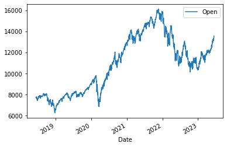
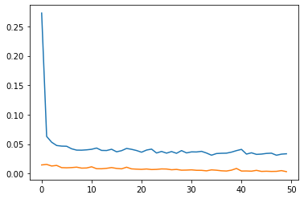
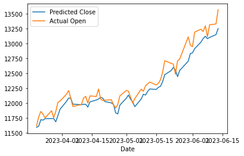

# MULTIVARIATE STOCK VALUE PREDICTION USING LONG-SHORT-TERM-MEMORY (LSTM)

##### NASDAQ data source: "https://finance.yahoo.com/quote/%5EIXIC/history?p=%5EIXIC"

### IMPORT LIBRARIES


```python
import pandas as pd
import numpy as np
from keras.models import Sequential, load_model
from keras.layers import LSTM, Dense, Dropout
from keras.callbacks import ModelCheckpoint
from sklearn.preprocessing import StandardScaler
import matplotlib.pyplot as plt
import seaborn as sns
```

### LOAD NASDAQ DATA


```python
nasdaq = pd.read_csv('nasdaq5Y.csv')
nasdaq.tail()
```


<div>

<table border="1" class="dataframe">
  <thead>
    <tr style="text-align: right;">
      <th></th>
      <th>Date</th>
      <th>Open</th>
      <th>High</th>
      <th>Low</th>
      <th>Close</th>
      <th>Adj Close</th>
      <th>Volume</th>
    </tr>
  </thead>
  <tbody>
    <tr>
      <th>1253</th>
      <td>2023-06-07</td>
      <td>13295.259766</td>
      <td>13361.900391</td>
      <td>13089.480469</td>
      <td>13104.900391</td>
      <td>13104.900391</td>
      <td>5270600000</td>
    </tr>
    <tr>
      <th>1254</th>
      <td>2023-06-08</td>
      <td>13113.269531</td>
      <td>13248.599609</td>
      <td>13101.179688</td>
      <td>13238.519531</td>
      <td>13238.519531</td>
      <td>4280160000</td>
    </tr>
    <tr>
      <th>1255</th>
      <td>2023-06-09</td>
      <td>13312.389648</td>
      <td>13385.950195</td>
      <td>13229.330078</td>
      <td>13259.139648</td>
      <td>13259.139648</td>
      <td>4412710000</td>
    </tr>
    <tr>
      <th>1256</th>
      <td>2023-06-12</td>
      <td>13326.370117</td>
      <td>13465.910156</td>
      <td>13302.580078</td>
      <td>13461.919922</td>
      <td>13461.919922</td>
      <td>4722680000</td>
    </tr>
    <tr>
      <th>1257</th>
      <td>2023-06-13</td>
      <td>13566.530273</td>
      <td>13594.400391</td>
      <td>13473.190430</td>
      <td>13573.320313</td>
      <td>13573.320313</td>
      <td>5522100000</td>
    </tr>
  </tbody>
</table>
</div>


### DATA CLEANING


```python
nasdaq['Date'] = pd.to_datetime(nasdaq['Date'])
nasdaq.plot.line(y="Open", x='Date');
```


    

    


```python
nasdaq.dtypes
```


    Date         datetime64[ns]
    Open                float64
    High                float64
    Low                 float64
    Close               float64
    Adj Close           float64
    Volume                int64
    dtype: object


```python
# nasdaq['Target'] = nasdaq['Open'].shift(-1)
# nasdaq.head()
```


```python
predictors = list(nasdaq)[1:6]
predictors
```


    ['Open', 'High', 'Low', 'Close', 'Adj Close']


```python
data = nasdaq[predictors].astype('float')
# data['Target'] = data['Open'].shift(-14)
data.head()
```


<div>

<table border="1" class="dataframe">
  <thead>
    <tr style="text-align: right;">
      <th></th>
      <th>Open</th>
      <th>High</th>
      <th>Low</th>
      <th>Close</th>
      <th>Adj Close</th>
    </tr>
  </thead>
  <tbody>
    <tr>
      <th>0</th>
      <td>7723.529785</td>
      <td>7768.600098</td>
      <td>7723.529785</td>
      <td>7761.040039</td>
      <td>7761.040039</td>
    </tr>
    <tr>
      <th>1</th>
      <td>7725.029785</td>
      <td>7755.720215</td>
      <td>7704.339844</td>
      <td>7746.379883</td>
      <td>7746.379883</td>
    </tr>
    <tr>
      <th>2</th>
      <td>7692.959961</td>
      <td>7749.359863</td>
      <td>7676.830078</td>
      <td>7747.029785</td>
      <td>7747.029785</td>
    </tr>
    <tr>
      <th>3</th>
      <td>7658.470215</td>
      <td>7727.410156</td>
      <td>7635.729980</td>
      <td>7725.589844</td>
      <td>7725.589844</td>
    </tr>
    <tr>
      <th>4</th>
      <td>7764.149902</td>
      <td>7806.600098</td>
      <td>7755.479980</td>
      <td>7781.509766</td>
      <td>7781.509766</td>
    </tr>
  </tbody>
</table>
</div>


```python
train_dates = nasdaq['Date']

```

### SCALING THE DATA


```python
scaler = StandardScaler()
scaler = scaler.fit(data)
data_scaled = scaler.transform(data)

data_scaled
```


    array([[-1.18217812, -1.18949504, -1.15733411, -1.16936247, -1.16936247],
           [-1.18161088, -1.19433607, -1.16465427, -1.17491047, -1.17491047],
           [-1.19373851, -1.19672667, -1.17514809, -1.17466452, -1.17466452],
           ...,
           [ 0.93132445,  0.92183972,  0.94289857,  0.91134128,  0.91134128],
           [ 0.93661135,  0.95189344,  0.97084039,  0.98808156,  0.98808156],
           [ 1.02743114,  1.00018772,  1.0359211 ,  1.03023998,  1.03023998]])


### Train - Test split


```python
trainX = []
trainY = []

testX = []
testY = []

# Train on last two weeks data and validate on the next day's Open price
n_future = 1
n_past = 14
test_length = 60

for i in range(n_past, len(data_scaled)-test_length):
    trainX.append(data_scaled[i-n_past:i, :6])
    trainY.append(data_scaled[i + n_future - 1:i + n_future, 0])

for j in range(len(data_scaled)-test_length, len(data_scaled)):
    testX.append(data_scaled[j-n_past:j, :6])
    testY.append(data_scaled[j:j+1, 0])

trainX = np.array(trainX)
trainY = np.array(trainY)

testX = np.array(testX)
testY = np.array(testY)

trainX.shape, trainY.shape, testX.shape, testY.shape
```


    ((1184, 14, 5), (1184, 1), (60, 14, 5), (60, 1))


### AUTOENCODER MODEL


```python
model = Sequential()
model.add(LSTM(64, activation='relu', input_shape=(trainX.shape[1], trainX.shape[2]), return_sequences=True))
model.add(LSTM(32, activation='relu', return_sequences=False))
model.add(Dropout(0.2))
model.add(Dense(trainY.shape[1]))

model.compile(optimizer='adam', loss='mse')
model.summary()
```

    Model: "sequential"
    _________________________________________________________________
     Layer (type)                Output Shape              Param #   
    =================================================================
     lstm (LSTM)                 (None, 14, 64)            17920     
                                                                     
     lstm_1 (LSTM)               (None, 32)                12416     
                                                                     
     dropout (Dropout)           (None, 32)                0         
                                                                     
     dense (Dense)               (None, 1)                 33        
                                                                     
    =================================================================
    Total params: 30,369
    Trainable params: 30,369
    Non-trainable params: 0
    _________________________________________________________________


#### FIT MODEL


```python
cp = ModelCheckpoint('model/', save_best_only=True)
```


```python
history = model.fit(trainX, trainY, epochs=50, batch_size=16, validation_split=0.1, verbose=1, callbacks=[cp])
```

    Epoch 1/50
    63/67 [===========================>..] - ETA: 0s - loss: 0.2823

    WARNING:absl:Found untraced functions such as _update_step_xla while saving (showing 1 of 1). These functions will not be directly callable after loading.


    INFO:tensorflow:Assets written to: model/assets


    INFO:tensorflow:Assets written to: model/assets


    67/67 [==============================] - 13s 146ms/step - loss: 0.2729 - val_loss: 0.0145
    Epoch 2/50
    67/67 [==============================] - 1s 8ms/step - loss: 0.0630 - val_loss: 0.0155
    Epoch 3/50
    63/67 [===========================>..] - ETA: 0s - loss: 0.0540

    WARNING:absl:Found untraced functions such as _update_step_xla while saving (showing 1 of 1). These functions will not be directly callable after loading.


    INFO:tensorflow:Assets written to: model/assets


    INFO:tensorflow:Assets written to: model/assets


    67/67 [==============================] - 9s 135ms/step - loss: 0.0532 - val_loss: 0.0127
    Epoch 4/50
    67/67 [==============================] - 1s 8ms/step - loss: 0.0476 - val_loss: 0.0137
    Epoch 5/50
    63/67 [===========================>..] - ETA: 0s - loss: 0.0465

    WARNING:absl:Found untraced functions such as _update_step_xla while saving (showing 1 of 1). These functions will not be directly callable after loading.


    INFO:tensorflow:Assets written to: model/assets


    INFO:tensorflow:Assets written to: model/assets


    67/67 [==============================] - 9s 134ms/step - loss: 0.0466 - val_loss: 0.0100
    Epoch 6/50
    63/67 [===========================>..] - ETA: 0s - loss: 0.0456

    WARNING:absl:Found untraced functions such as _update_step_xla while saving (showing 1 of 1). These functions will not be directly callable after loading.


    INFO:tensorflow:Assets written to: model/assets


    INFO:tensorflow:Assets written to: model/assets


    67/67 [==============================] - 9s 131ms/step - loss: 0.0463 - val_loss: 0.0097
    Epoch 7/50
    67/67 [==============================] - 1s 8ms/step - loss: 0.0420 - val_loss: 0.0100
    Epoch 8/50
    67/67 [==============================] - 1s 8ms/step - loss: 0.0397 - val_loss: 0.0108
    Epoch 9/50
    67/67 [==============================] - ETA: 0s - loss: 0.0396

    WARNING:absl:Found untraced functions such as _update_step_xla while saving (showing 1 of 1). These functions will not be directly callable after loading.


    INFO:tensorflow:Assets written to: model/assets


    INFO:tensorflow:Assets written to: model/assets


    67/67 [==============================] - 9s 133ms/step - loss: 0.0396 - val_loss: 0.0091
    Epoch 10/50
    67/67 [==============================] - 1s 9ms/step - loss: 0.0402 - val_loss: 0.0093
    Epoch 11/50
    67/67 [==============================] - 1s 8ms/step - loss: 0.0412 - val_loss: 0.0114
    Epoch 12/50
    64/67 [===========================>..] - ETA: 0s - loss: 0.0436

    WARNING:absl:Found untraced functions such as _update_step_xla while saving (showing 1 of 1). These functions will not be directly callable after loading.


    INFO:tensorflow:Assets written to: model/assets


    INFO:tensorflow:Assets written to: model/assets


    67/67 [==============================] - 10s 153ms/step - loss: 0.0433 - val_loss: 0.0081
    Epoch 13/50
    67/67 [==============================] - ETA: 0s - loss: 0.0392

    WARNING:absl:Found untraced functions such as _update_step_xla while saving (showing 1 of 1). These functions will not be directly callable after loading.


    INFO:tensorflow:Assets written to: model/assets


    INFO:tensorflow:Assets written to: model/assets


    67/67 [==============================] - 9s 142ms/step - loss: 0.0392 - val_loss: 0.0080
    Epoch 14/50
    67/67 [==============================] - 1s 8ms/step - loss: 0.0391 - val_loss: 0.0088
    Epoch 15/50
    67/67 [==============================] - 1s 8ms/step - loss: 0.0412 - val_loss: 0.0101
    Epoch 16/50
    67/67 [==============================] - 1s 8ms/step - loss: 0.0369 - val_loss: 0.0086
    Epoch 17/50
    67/67 [==============================] - ETA: 0s - loss: 0.0388

    WARNING:absl:Found untraced functions such as _update_step_xla while saving (showing 1 of 1). These functions will not be directly callable after loading.


    INFO:tensorflow:Assets written to: model/assets


    INFO:tensorflow:Assets written to: model/assets


    67/67 [==============================] - 9s 138ms/step - loss: 0.0388 - val_loss: 0.0079
    Epoch 18/50
    67/67 [==============================] - 1s 8ms/step - loss: 0.0426 - val_loss: 0.0107
    Epoch 19/50
    66/67 [============================>.] - ETA: 0s - loss: 0.0412

    WARNING:absl:Found untraced functions such as _update_step_xla while saving (showing 1 of 1). These functions will not be directly callable after loading.


    INFO:tensorflow:Assets written to: model/assets


    INFO:tensorflow:Assets written to: model/assets


    67/67 [==============================] - 9s 142ms/step - loss: 0.0411 - val_loss: 0.0079
    Epoch 20/50
    64/67 [===========================>..] - ETA: 0s - loss: 0.0392

    WARNING:absl:Found untraced functions such as _update_step_xla while saving (showing 1 of 1). These functions will not be directly callable after loading.


    INFO:tensorflow:Assets written to: model/assets


    INFO:tensorflow:Assets written to: model/assets


    67/67 [==============================] - 10s 147ms/step - loss: 0.0391 - val_loss: 0.0074
    Epoch 21/50
    63/67 [===========================>..] - ETA: 0s - loss: 0.0365

    WARNING:absl:Found untraced functions such as _update_step_xla while saving (showing 1 of 1). These functions will not be directly callable after loading.


    INFO:tensorflow:Assets written to: model/assets


    INFO:tensorflow:Assets written to: model/assets


    67/67 [==============================] - 9s 137ms/step - loss: 0.0362 - val_loss: 0.0070
    Epoch 22/50
    67/67 [==============================] - 1s 9ms/step - loss: 0.0398 - val_loss: 0.0077
    Epoch 23/50
    64/67 [===========================>..] - ETA: 0s - loss: 0.0416

    WARNING:absl:Found untraced functions such as _update_step_xla while saving (showing 1 of 1). These functions will not be directly callable after loading.


    INFO:tensorflow:Assets written to: model/assets


    INFO:tensorflow:Assets written to: model/assets


    67/67 [==============================] - 9s 136ms/step - loss: 0.0415 - val_loss: 0.0067
    Epoch 24/50
    67/67 [==============================] - 1s 9ms/step - loss: 0.0348 - val_loss: 0.0070
    Epoch 25/50
    67/67 [==============================] - 1s 9ms/step - loss: 0.0375 - val_loss: 0.0078
    Epoch 26/50
    67/67 [==============================] - 1s 8ms/step - loss: 0.0346 - val_loss: 0.0076
    Epoch 27/50
    64/67 [===========================>..] - ETA: 0s - loss: 0.0364

    WARNING:absl:Found untraced functions such as _update_step_xla while saving (showing 1 of 1). These functions will not be directly callable after loading.


    INFO:tensorflow:Assets written to: model/assets


    INFO:tensorflow:Assets written to: model/assets


    67/67 [==============================] - 9s 141ms/step - loss: 0.0373 - val_loss: 0.0063
    Epoch 28/50
    67/67 [==============================] - 1s 8ms/step - loss: 0.0343 - val_loss: 0.0069
    Epoch 29/50
    63/67 [===========================>..] - ETA: 0s - loss: 0.0393

    WARNING:absl:Found untraced functions such as _update_step_xla while saving (showing 1 of 1). These functions will not be directly callable after loading.


    INFO:tensorflow:Assets written to: model/assets


    INFO:tensorflow:Assets written to: model/assets


    67/67 [==============================] - 9s 141ms/step - loss: 0.0389 - val_loss: 0.0056
    Epoch 30/50
    67/67 [==============================] - 1s 8ms/step - loss: 0.0350 - val_loss: 0.0058
    Epoch 31/50
    67/67 [==============================] - 1s 8ms/step - loss: 0.0367 - val_loss: 0.0062
    Epoch 32/50
    63/67 [===========================>..] - ETA: 0s - loss: 0.0371

    WARNING:absl:Found untraced functions such as _update_step_xla while saving (showing 1 of 1). These functions will not be directly callable after loading.


    INFO:tensorflow:Assets written to: model/assets


    INFO:tensorflow:Assets written to: model/assets


    67/67 [==============================] - 9s 143ms/step - loss: 0.0366 - val_loss: 0.0054
    Epoch 33/50
    63/67 [===========================>..] - ETA: 0s - loss: 0.0375

    WARNING:absl:Found untraced functions such as _update_step_xla while saving (showing 1 of 1). These functions will not be directly callable after loading.


    INFO:tensorflow:Assets written to: model/assets


    INFO:tensorflow:Assets written to: model/assets


    67/67 [==============================] - 9s 135ms/step - loss: 0.0377 - val_loss: 0.0053
    Epoch 34/50
    66/67 [============================>.] - ETA: 0s - loss: 0.0346

    WARNING:absl:Found untraced functions such as _update_step_xla while saving (showing 1 of 1). These functions will not be directly callable after loading.


    INFO:tensorflow:Assets written to: model/assets


    INFO:tensorflow:Assets written to: model/assets


    67/67 [==============================] - 9s 139ms/step - loss: 0.0348 - val_loss: 0.0045
    Epoch 35/50
    67/67 [==============================] - 1s 10ms/step - loss: 0.0311 - val_loss: 0.0062
    Epoch 36/50
    67/67 [==============================] - 1s 9ms/step - loss: 0.0339 - val_loss: 0.0055
    Epoch 37/50
    67/67 [==============================] - 1s 8ms/step - loss: 0.0344 - val_loss: 0.0046
    Epoch 38/50
    65/67 [============================>.] - ETA: 0s - loss: 0.0347

    WARNING:absl:Found untraced functions such as _update_step_xla while saving (showing 1 of 1). These functions will not be directly callable after loading.


    INFO:tensorflow:Assets written to: model/assets


    INFO:tensorflow:Assets written to: model/assets


    67/67 [==============================] - 9s 141ms/step - loss: 0.0346 - val_loss: 0.0042
    Epoch 39/50
    67/67 [==============================] - 1s 8ms/step - loss: 0.0363 - val_loss: 0.0057
    Epoch 40/50
    67/67 [==============================] - 1s 8ms/step - loss: 0.0389 - val_loss: 0.0086
    Epoch 41/50
    63/67 [===========================>..] - ETA: 0s - loss: 0.0413

    WARNING:absl:Found untraced functions such as _update_step_xla while saving (showing 1 of 1). These functions will not be directly callable after loading.


    INFO:tensorflow:Assets written to: model/assets


    INFO:tensorflow:Assets written to: model/assets


    67/67 [==============================] - 9s 135ms/step - loss: 0.0410 - val_loss: 0.0042
    Epoch 42/50
    67/67 [==============================] - 1s 8ms/step - loss: 0.0330 - val_loss: 0.0042
    Epoch 43/50
    64/67 [===========================>..] - ETA: 0s - loss: 0.0354

    WARNING:absl:Found untraced functions such as _update_step_xla while saving (showing 1 of 1). These functions will not be directly callable after loading.


    INFO:tensorflow:Assets written to: model/assets


    INFO:tensorflow:Assets written to: model/assets


    67/67 [==============================] - 9s 143ms/step - loss: 0.0352 - val_loss: 0.0039
    Epoch 44/50
    67/67 [==============================] - 1s 8ms/step - loss: 0.0325 - val_loss: 0.0053
    Epoch 45/50
    67/67 [==============================] - ETA: 0s - loss: 0.0330

    WARNING:absl:Found untraced functions such as _update_step_xla while saving (showing 1 of 1). These functions will not be directly callable after loading.


    INFO:tensorflow:Assets written to: model/assets


    INFO:tensorflow:Assets written to: model/assets


    67/67 [==============================] - 9s 142ms/step - loss: 0.0330 - val_loss: 0.0035
    Epoch 46/50
    67/67 [==============================] - 1s 8ms/step - loss: 0.0341 - val_loss: 0.0038
    Epoch 47/50
    67/67 [==============================] - ETA: 0s - loss: 0.0345

    WARNING:absl:Found untraced functions such as _update_step_xla while saving (showing 1 of 1). These functions will not be directly callable after loading.


    INFO:tensorflow:Assets written to: model/assets


    INFO:tensorflow:Assets written to: model/assets


    67/67 [==============================] - 9s 143ms/step - loss: 0.0345 - val_loss: 0.0035
    Epoch 48/50
    67/67 [==============================] - 1s 8ms/step - loss: 0.0311 - val_loss: 0.0036
    Epoch 49/50
    67/67 [==============================] - 1s 8ms/step - loss: 0.0329 - val_loss: 0.0049
    Epoch 50/50
    62/67 [==========================>...] - ETA: 0s - loss: 0.0337

    WARNING:absl:Found untraced functions such as _update_step_xla while saving (showing 1 of 1). These functions will not be directly callable after loading.


    INFO:tensorflow:Assets written to: model/assets


    INFO:tensorflow:Assets written to: model/assets


    67/67 [==============================] - 9s 134ms/step - loss: 0.0335 - val_loss: 0.0031


```python
plt.plot(history.history['loss'], label='Training')
plt.plot(history.history['val_loss'], label='Validation')
plt.show()
```


    

    


#### MODEL FORECAST / PREDICTION


```python
forecast = model.predict(testX)
```

    2/2 [==============================] - 0s 5ms/step


```python
forecast_copies = np.repeat(forecast, data.shape[1], axis=-1)

y_pred_future = scaler.inverse_transform(forecast_copies)[:,0]

y_pred_future
```


    array([11589.228 , 11609.593 , 11718.758 , 11710.565 , 11735.488 ,
           11735.825 , 11737.535 , 11681.95  , 11787.94  , 11894.1   ,
           12025.134 , 12081.811 , 12080.715 , 11978.82  , 11970.64  ,
           11976.065 , 11976.316 , 11930.421 , 12017.879 , 12048.492 ,
           12066.058 , 12092.876 , 12079.489 , 12022.46  , 11999.987 ,
           11978.304 , 11835.053 , 11814.392 , 11963.374 , 12078.064 ,
           12132.09  , 12064.782 , 12014.09  , 11936.56  , 12067.049 ,
           12146.139 , 12131.77  , 12192.427 , 12234.682 , 12226.481 ,
           12261.272 , 12279.146 , 12355.244 , 12474.951 , 12542.373 ,
           12595.955 , 12550.24  , 12441.765 , 12545.482 , 12701.78  ,
           12829.412 , 12841.229 , 12911.143 , 13023.546 , 13083.1045,
           13119.958 , 13079.108 , 13100.647 , 13146.875 , 13249.3545],
          dtype=float32)


```python
forecast_period_dates = list(train_dates)[-test_length:]
forecast_dates = []
for time_i in forecast_period_dates:
    forecast_dates.append(time_i.date())

data_forecast = pd.DataFrame({'Date':np.array(forecast_dates), 'Predicted Close':y_pred_future, 'Actual Open':data['Open'].tail(test_length)})
```


```python
data_forecast.index = data_forecast['Date']
data_forecast.head()
```


<div>

<table border="1" class="dataframe">
  <thead>
    <tr style="text-align: right;">
      <th></th>
      <th>Date</th>
      <th>Predicted Close</th>
      <th>Actual Open</th>
    </tr>
    <tr>
      <th>Date</th>
      <th></th>
      <th></th>
      <th></th>
    </tr>
  </thead>
  <tbody>
    <tr>
      <th>2023-03-20</th>
      <td>2023-03-20</td>
      <td>11589.227539</td>
      <td>11614.389648</td>
    </tr>
    <tr>
      <th>2023-03-21</th>
      <td>2023-03-21</td>
      <td>11609.592773</td>
      <td>11764.790039</td>
    </tr>
    <tr>
      <th>2023-03-22</th>
      <td>2023-03-22</td>
      <td>11718.757812</td>
      <td>11857.500000</td>
    </tr>
    <tr>
      <th>2023-03-23</th>
      <td>2023-03-23</td>
      <td>11710.565430</td>
      <td>11811.320313</td>
    </tr>
    <tr>
      <th>2023-03-24</th>
      <td>2023-03-24</td>
      <td>11735.488281</td>
      <td>11747.620117</td>
    </tr>
  </tbody>
</table>
</div>


```python
data_forecast.plot();
```


    

    


## OBSERVATION: 
###  - Even though the model is not near identical to the actual price,  from the plot above it is evident that it is quite effective in detecting the trend (rise / fall) of the stock value. 
###  - Converting the model to a classification task of "Will the price increase the next day?" should result in improved effectiveness. 
### - Additionally, training for more epochs in addition to training on more data (10 years data) could prove effctive.


```python

```


```python

```
