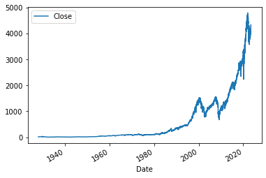
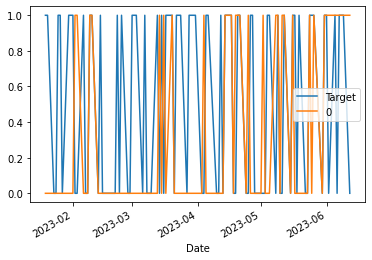

# Stock Market Prediction (SP500) using Machine Learning

### IMPORT LIBRARIES


```python
import yfinance as yf
```

    /Users/tonmoydey/opt/anaconda3/lib/python3.8/site-packages/pandas/core/computation/expressions.py:20: UserWarning: Pandas requires version '2.7.3' or newer of 'numexpr' (version '2.7.1' currently installed).
      from pandas.core.computation.check import NUMEXPR_INSTALLED


### LOAD SP500 DATA


```python
sp500 = yf.Ticker("^GSPC")
```


```python
sp500 = sp500.history(period="max")
```


```python
sp500
```


<div>

<table border="1" class="dataframe">
  <thead>
    <tr style="text-align: right;">
      <th></th>
      <th>Open</th>
      <th>High</th>
      <th>Low</th>
      <th>Close</th>
      <th>Volume</th>
      <th>Dividends</th>
      <th>Stock Splits</th>
    </tr>
    <tr>
      <th>Date</th>
      <th></th>
      <th></th>
      <th></th>
      <th></th>
      <th></th>
      <th></th>
      <th></th>
    </tr>
  </thead>
  <tbody>
    <tr>
      <th>1927-12-30 00:00:00-05:00</th>
      <td>17.660000</td>
      <td>17.660000</td>
      <td>17.660000</td>
      <td>17.660000</td>
      <td>0</td>
      <td>0.0</td>
      <td>0.0</td>
    </tr>
    <tr>
      <th>1928-01-03 00:00:00-05:00</th>
      <td>17.760000</td>
      <td>17.760000</td>
      <td>17.760000</td>
      <td>17.760000</td>
      <td>0</td>
      <td>0.0</td>
      <td>0.0</td>
    </tr>
    <tr>
      <th>1928-01-04 00:00:00-05:00</th>
      <td>17.719999</td>
      <td>17.719999</td>
      <td>17.719999</td>
      <td>17.719999</td>
      <td>0</td>
      <td>0.0</td>
      <td>0.0</td>
    </tr>
    <tr>
      <th>1928-01-05 00:00:00-05:00</th>
      <td>17.549999</td>
      <td>17.549999</td>
      <td>17.549999</td>
      <td>17.549999</td>
      <td>0</td>
      <td>0.0</td>
      <td>0.0</td>
    </tr>
    <tr>
      <th>1928-01-06 00:00:00-05:00</th>
      <td>17.660000</td>
      <td>17.660000</td>
      <td>17.660000</td>
      <td>17.660000</td>
      <td>0</td>
      <td>0.0</td>
      <td>0.0</td>
    </tr>
    <tr>
      <th>...</th>
      <td>...</td>
      <td>...</td>
      <td>...</td>
      <td>...</td>
      <td>...</td>
      <td>...</td>
      <td>...</td>
    </tr>
    <tr>
      <th>2023-06-06 00:00:00-04:00</th>
      <td>4271.339844</td>
      <td>4288.330078</td>
      <td>4263.089844</td>
      <td>4283.850098</td>
      <td>3996560000</td>
      <td>0.0</td>
      <td>0.0</td>
    </tr>
    <tr>
      <th>2023-06-07 00:00:00-04:00</th>
      <td>4285.470215</td>
      <td>4299.189941</td>
      <td>4263.959961</td>
      <td>4267.520020</td>
      <td>4537800000</td>
      <td>0.0</td>
      <td>0.0</td>
    </tr>
    <tr>
      <th>2023-06-08 00:00:00-04:00</th>
      <td>4268.689941</td>
      <td>4298.009766</td>
      <td>4261.069824</td>
      <td>4293.930176</td>
      <td>3826740000</td>
      <td>0.0</td>
      <td>0.0</td>
    </tr>
    <tr>
      <th>2023-06-09 00:00:00-04:00</th>
      <td>4304.879883</td>
      <td>4322.620117</td>
      <td>4291.700195</td>
      <td>4298.859863</td>
      <td>3786510000</td>
      <td>0.0</td>
      <td>0.0</td>
    </tr>
    <tr>
      <th>2023-06-12 00:00:00-04:00</th>
      <td>4308.319824</td>
      <td>4340.129883</td>
      <td>4304.370117</td>
      <td>4338.930176</td>
      <td>3945670000</td>
      <td>0.0</td>
      <td>0.0</td>
    </tr>
  </tbody>
</table>
<p>23976 rows × 7 columns</p>
</div>


```python
sp500.index
```


    DatetimeIndex(['1927-12-30 00:00:00-05:00', '1928-01-03 00:00:00-05:00',
                   '1928-01-04 00:00:00-05:00', '1928-01-05 00:00:00-05:00',
                   '1928-01-06 00:00:00-05:00', '1928-01-09 00:00:00-05:00',
                   '1928-01-10 00:00:00-05:00', '1928-01-11 00:00:00-05:00',
                   '1928-01-12 00:00:00-05:00', '1928-01-13 00:00:00-05:00',
                   ...
                   '2023-05-30 00:00:00-04:00', '2023-05-31 00:00:00-04:00',
                   '2023-06-01 00:00:00-04:00', '2023-06-02 00:00:00-04:00',
                   '2023-06-05 00:00:00-04:00', '2023-06-06 00:00:00-04:00',
                   '2023-06-07 00:00:00-04:00', '2023-06-08 00:00:00-04:00',
                   '2023-06-09 00:00:00-04:00', '2023-06-12 00:00:00-04:00'],
                  dtype='datetime64[ns, America/New_York]', name='Date', length=23976, freq=None)


### DATA CLEANING


```python
sp500.plot.line(y="Close", use_index=True)
```


    <AxesSubplot:xlabel='Date'>


    

    


```python
del sp500["Dividends"]
del sp500["Stock Splits"]
```


```python
sp500.head()
```


<div>

<table border="1" class="dataframe">
  <thead>
    <tr style="text-align: right;">
      <th></th>
      <th>Open</th>
      <th>High</th>
      <th>Low</th>
      <th>Close</th>
      <th>Volume</th>
    </tr>
    <tr>
      <th>Date</th>
      <th></th>
      <th></th>
      <th></th>
      <th></th>
      <th></th>
    </tr>
  </thead>
  <tbody>
    <tr>
      <th>1927-12-30 00:00:00-05:00</th>
      <td>17.660000</td>
      <td>17.660000</td>
      <td>17.660000</td>
      <td>17.660000</td>
      <td>0</td>
    </tr>
    <tr>
      <th>1928-01-03 00:00:00-05:00</th>
      <td>17.760000</td>
      <td>17.760000</td>
      <td>17.760000</td>
      <td>17.760000</td>
      <td>0</td>
    </tr>
    <tr>
      <th>1928-01-04 00:00:00-05:00</th>
      <td>17.719999</td>
      <td>17.719999</td>
      <td>17.719999</td>
      <td>17.719999</td>
      <td>0</td>
    </tr>
    <tr>
      <th>1928-01-05 00:00:00-05:00</th>
      <td>17.549999</td>
      <td>17.549999</td>
      <td>17.549999</td>
      <td>17.549999</td>
      <td>0</td>
    </tr>
    <tr>
      <th>1928-01-06 00:00:00-05:00</th>
      <td>17.660000</td>
      <td>17.660000</td>
      <td>17.660000</td>
      <td>17.660000</td>
      <td>0</td>
    </tr>
  </tbody>
</table>
</div>


### EXTRACTING ESSENTIAL DATA for PREDICTION


```python
sp500["Tomorrow"] = sp500["Close"].shift(-1)
sp500.head()
```


<div>

<table border="1" class="dataframe">
  <thead>
    <tr style="text-align: right;">
      <th></th>
      <th>Open</th>
      <th>High</th>
      <th>Low</th>
      <th>Close</th>
      <th>Volume</th>
      <th>Tomorrow</th>
    </tr>
    <tr>
      <th>Date</th>
      <th></th>
      <th></th>
      <th></th>
      <th></th>
      <th></th>
      <th></th>
    </tr>
  </thead>
  <tbody>
    <tr>
      <th>1927-12-30 00:00:00-05:00</th>
      <td>17.660000</td>
      <td>17.660000</td>
      <td>17.660000</td>
      <td>17.660000</td>
      <td>0</td>
      <td>17.760000</td>
    </tr>
    <tr>
      <th>1928-01-03 00:00:00-05:00</th>
      <td>17.760000</td>
      <td>17.760000</td>
      <td>17.760000</td>
      <td>17.760000</td>
      <td>0</td>
      <td>17.719999</td>
    </tr>
    <tr>
      <th>1928-01-04 00:00:00-05:00</th>
      <td>17.719999</td>
      <td>17.719999</td>
      <td>17.719999</td>
      <td>17.719999</td>
      <td>0</td>
      <td>17.549999</td>
    </tr>
    <tr>
      <th>1928-01-05 00:00:00-05:00</th>
      <td>17.549999</td>
      <td>17.549999</td>
      <td>17.549999</td>
      <td>17.549999</td>
      <td>0</td>
      <td>17.660000</td>
    </tr>
    <tr>
      <th>1928-01-06 00:00:00-05:00</th>
      <td>17.660000</td>
      <td>17.660000</td>
      <td>17.660000</td>
      <td>17.660000</td>
      <td>0</td>
      <td>17.500000</td>
    </tr>
  </tbody>
</table>
</div>


```python
sp500["Target"] = (sp500["Tomorrow"] > sp500["Close"]).astype(int)
sp500.head()
```


<div>

<table border="1" class="dataframe">
  <thead>
    <tr style="text-align: right;">
      <th></th>
      <th>Open</th>
      <th>High</th>
      <th>Low</th>
      <th>Close</th>
      <th>Volume</th>
      <th>Tomorrow</th>
      <th>Target</th>
    </tr>
    <tr>
      <th>Date</th>
      <th></th>
      <th></th>
      <th></th>
      <th></th>
      <th></th>
      <th></th>
      <th></th>
    </tr>
  </thead>
  <tbody>
    <tr>
      <th>1927-12-30 00:00:00-05:00</th>
      <td>17.660000</td>
      <td>17.660000</td>
      <td>17.660000</td>
      <td>17.660000</td>
      <td>0</td>
      <td>17.760000</td>
      <td>1</td>
    </tr>
    <tr>
      <th>1928-01-03 00:00:00-05:00</th>
      <td>17.760000</td>
      <td>17.760000</td>
      <td>17.760000</td>
      <td>17.760000</td>
      <td>0</td>
      <td>17.719999</td>
      <td>0</td>
    </tr>
    <tr>
      <th>1928-01-04 00:00:00-05:00</th>
      <td>17.719999</td>
      <td>17.719999</td>
      <td>17.719999</td>
      <td>17.719999</td>
      <td>0</td>
      <td>17.549999</td>
      <td>0</td>
    </tr>
    <tr>
      <th>1928-01-05 00:00:00-05:00</th>
      <td>17.549999</td>
      <td>17.549999</td>
      <td>17.549999</td>
      <td>17.549999</td>
      <td>0</td>
      <td>17.660000</td>
      <td>1</td>
    </tr>
    <tr>
      <th>1928-01-06 00:00:00-05:00</th>
      <td>17.660000</td>
      <td>17.660000</td>
      <td>17.660000</td>
      <td>17.660000</td>
      <td>0</td>
      <td>17.500000</td>
      <td>0</td>
    </tr>
  </tbody>
</table>
</div>


```python
sp500 = sp500.loc["1990-01-01":].copy()
sp500.head()
```


<div>

<table border="1" class="dataframe">
  <thead>
    <tr style="text-align: right;">
      <th></th>
      <th>Open</th>
      <th>High</th>
      <th>Low</th>
      <th>Close</th>
      <th>Volume</th>
      <th>Tomorrow</th>
      <th>Target</th>
    </tr>
    <tr>
      <th>Date</th>
      <th></th>
      <th></th>
      <th></th>
      <th></th>
      <th></th>
      <th></th>
      <th></th>
    </tr>
  </thead>
  <tbody>
    <tr>
      <th>1990-01-02 00:00:00-05:00</th>
      <td>353.399994</td>
      <td>359.690002</td>
      <td>351.980011</td>
      <td>359.690002</td>
      <td>162070000</td>
      <td>358.760010</td>
      <td>0</td>
    </tr>
    <tr>
      <th>1990-01-03 00:00:00-05:00</th>
      <td>359.690002</td>
      <td>360.589996</td>
      <td>357.890015</td>
      <td>358.760010</td>
      <td>192330000</td>
      <td>355.670013</td>
      <td>0</td>
    </tr>
    <tr>
      <th>1990-01-04 00:00:00-05:00</th>
      <td>358.760010</td>
      <td>358.760010</td>
      <td>352.890015</td>
      <td>355.670013</td>
      <td>177000000</td>
      <td>352.200012</td>
      <td>0</td>
    </tr>
    <tr>
      <th>1990-01-05 00:00:00-05:00</th>
      <td>355.670013</td>
      <td>355.670013</td>
      <td>351.350006</td>
      <td>352.200012</td>
      <td>158530000</td>
      <td>353.790009</td>
      <td>1</td>
    </tr>
    <tr>
      <th>1990-01-08 00:00:00-05:00</th>
      <td>352.200012</td>
      <td>354.239990</td>
      <td>350.540009</td>
      <td>353.790009</td>
      <td>140110000</td>
      <td>349.619995</td>
      <td>0</td>
    </tr>
  </tbody>
</table>
</div>


### MODEL TRAINING


```python
from sklearn.ensemble import RandomForestClassifier
from sklearn.metrics import precision_score
import pandas as pd
```


```python
model = RandomForestClassifier(n_estimators=100, min_samples_split=100, random_state=1)

train = sp500.iloc[:-100]
test = sp500.iloc[-100:]

predictors = ["Close", "Volume", "Open", "High", "Low"]

model.fit(train[predictors], train["Target"])
```


    RandomForestClassifier(min_samples_split=100, random_state=1)


```python
preds = model.predict(test[predictors])

preds = pd.Series(preds, index=test.index)

preds
```


    Date
    2023-01-19 00:00:00-05:00    0
    2023-01-20 00:00:00-05:00    0
    2023-01-23 00:00:00-05:00    0
    2023-01-24 00:00:00-05:00    0
    2023-01-25 00:00:00-05:00    0
                                ..
    2023-06-06 00:00:00-04:00    1
    2023-06-07 00:00:00-04:00    1
    2023-06-08 00:00:00-04:00    1
    2023-06-09 00:00:00-04:00    1
    2023-06-12 00:00:00-04:00    1
    Length: 100, dtype: int64


```python
precision_score(test["Target"], preds)
```


    0.5806451612903226


```python
combined = pd.concat([test["Target"], preds], axis=1)

combined.plot()
```


    <AxesSubplot:xlabel='Date'>


    

    


### BACKTESTING SYSTEM


```python
def predict(train, test, predictors, model):
    model.fit(train[predictors], train["Target"])
    
    preds = model.predict(test[predictors])
    
    preds = pd.Series(preds, index=test.index, name="Predictions")
    
    combined = pd.concat([test["Target"], preds], axis=1)
    
    return combined
```


```python
def backtest(data, model, predictors, start=2500, step=250):
    all_predictions = []
    
    for i in range(start, data.shape[0], step):
        train = data.iloc[0:i].copy()
        test = data.iloc[i:(i+step)].copy()
        
        predictions = predict(train, test, predictors, model)
        
        all_predictions.append(predictions)
    
    return pd.concat(all_predictions)
        
```


```python
predictions = backtest(sp500, model, predictors)
```


```python
predictions["Predictions"].value_counts()
```


    Predictions
    0    3431
    1    2495
    Name: count, dtype: int64


```python
precision_score(predictions["Target"], predictions["Predictions"])
```


    0.5290581162324649


```python
predictions["Target"].value_counts() / predictions.shape[0]
```


    Target
    1    0.533918
    0    0.466082
    Name: count, dtype: float64


### MODEL TUNING


```python
horizons = [2, 5, 60, 250, 1000]

new_predictors = []

for horizon in horizons:
    rolling_avg = sp500.rolling(horizon).mean()
    
    ratio_column = f"Close_Ratio_{horizon}"
    sp500[ratio_column] = sp500["Close"] / rolling_avg["Close"]
    
    trend_column = f"Trend_{horizon}"
    sp500[trend_column] = sp500.shift(1).rolling(horizon).sum()["Target"]
    
    new_predictors += [ratio_column, trend_column]
```


```python
sp500.head()
```


<div>

<table border="1" class="dataframe">
  <thead>
    <tr style="text-align: right;">
      <th></th>
      <th>Open</th>
      <th>High</th>
      <th>Low</th>
      <th>Close</th>
      <th>Volume</th>
      <th>Tomorrow</th>
      <th>Target</th>
      <th>Close_Ratio_2</th>
      <th>Trend_2</th>
      <th>Close_Ratio_5</th>
      <th>Trend_5</th>
      <th>Close_Ratio_60</th>
      <th>Trend_60</th>
      <th>Close_Ratio_250</th>
      <th>Trend_250</th>
      <th>Close_Ratio_1000</th>
      <th>Trend_1000</th>
    </tr>
    <tr>
      <th>Date</th>
      <th></th>
      <th></th>
      <th></th>
      <th></th>
      <th></th>
      <th></th>
      <th></th>
      <th></th>
      <th></th>
      <th></th>
      <th></th>
      <th></th>
      <th></th>
      <th></th>
      <th></th>
      <th></th>
      <th></th>
    </tr>
  </thead>
  <tbody>
    <tr>
      <th>1990-01-02 00:00:00-05:00</th>
      <td>353.399994</td>
      <td>359.690002</td>
      <td>351.980011</td>
      <td>359.690002</td>
      <td>162070000</td>
      <td>358.760010</td>
      <td>0</td>
      <td>NaN</td>
      <td>NaN</td>
      <td>NaN</td>
      <td>NaN</td>
      <td>NaN</td>
      <td>NaN</td>
      <td>NaN</td>
      <td>NaN</td>
      <td>NaN</td>
      <td>NaN</td>
    </tr>
    <tr>
      <th>1990-01-03 00:00:00-05:00</th>
      <td>359.690002</td>
      <td>360.589996</td>
      <td>357.890015</td>
      <td>358.760010</td>
      <td>192330000</td>
      <td>355.670013</td>
      <td>0</td>
      <td>0.998706</td>
      <td>NaN</td>
      <td>NaN</td>
      <td>NaN</td>
      <td>NaN</td>
      <td>NaN</td>
      <td>NaN</td>
      <td>NaN</td>
      <td>NaN</td>
      <td>NaN</td>
    </tr>
    <tr>
      <th>1990-01-04 00:00:00-05:00</th>
      <td>358.760010</td>
      <td>358.760010</td>
      <td>352.890015</td>
      <td>355.670013</td>
      <td>177000000</td>
      <td>352.200012</td>
      <td>0</td>
      <td>0.995675</td>
      <td>0.0</td>
      <td>NaN</td>
      <td>NaN</td>
      <td>NaN</td>
      <td>NaN</td>
      <td>NaN</td>
      <td>NaN</td>
      <td>NaN</td>
      <td>NaN</td>
    </tr>
    <tr>
      <th>1990-01-05 00:00:00-05:00</th>
      <td>355.670013</td>
      <td>355.670013</td>
      <td>351.350006</td>
      <td>352.200012</td>
      <td>158530000</td>
      <td>353.790009</td>
      <td>1</td>
      <td>0.995098</td>
      <td>0.0</td>
      <td>NaN</td>
      <td>NaN</td>
      <td>NaN</td>
      <td>NaN</td>
      <td>NaN</td>
      <td>NaN</td>
      <td>NaN</td>
      <td>NaN</td>
    </tr>
    <tr>
      <th>1990-01-08 00:00:00-05:00</th>
      <td>352.200012</td>
      <td>354.239990</td>
      <td>350.540009</td>
      <td>353.790009</td>
      <td>140110000</td>
      <td>349.619995</td>
      <td>0</td>
      <td>1.002252</td>
      <td>1.0</td>
      <td>0.993731</td>
      <td>NaN</td>
      <td>NaN</td>
      <td>NaN</td>
      <td>NaN</td>
      <td>NaN</td>
      <td>NaN</td>
      <td>NaN</td>
    </tr>
  </tbody>
</table>
</div>


```python
sp500 = sp500.dropna()

sp500.head()
```


<div>

<table border="1" class="dataframe">
  <thead>
    <tr style="text-align: right;">
      <th></th>
      <th>Open</th>
      <th>High</th>
      <th>Low</th>
      <th>Close</th>
      <th>Volume</th>
      <th>Tomorrow</th>
      <th>Target</th>
      <th>Close_Ratio_2</th>
      <th>Trend_2</th>
      <th>Close_Ratio_5</th>
      <th>Trend_5</th>
      <th>Close_Ratio_60</th>
      <th>Trend_60</th>
      <th>Close_Ratio_250</th>
      <th>Trend_250</th>
      <th>Close_Ratio_1000</th>
      <th>Trend_1000</th>
    </tr>
    <tr>
      <th>Date</th>
      <th></th>
      <th></th>
      <th></th>
      <th></th>
      <th></th>
      <th></th>
      <th></th>
      <th></th>
      <th></th>
      <th></th>
      <th></th>
      <th></th>
      <th></th>
      <th></th>
      <th></th>
      <th></th>
      <th></th>
    </tr>
  </thead>
  <tbody>
    <tr>
      <th>1993-12-14 00:00:00-05:00</th>
      <td>465.730011</td>
      <td>466.119995</td>
      <td>462.459991</td>
      <td>463.059998</td>
      <td>275050000</td>
      <td>461.839996</td>
      <td>0</td>
      <td>0.997157</td>
      <td>1.0</td>
      <td>0.996617</td>
      <td>1.0</td>
      <td>1.000283</td>
      <td>32.0</td>
      <td>1.028047</td>
      <td>127.0</td>
      <td>1.176082</td>
      <td>512.0</td>
    </tr>
    <tr>
      <th>1993-12-15 00:00:00-05:00</th>
      <td>463.059998</td>
      <td>463.690002</td>
      <td>461.839996</td>
      <td>461.839996</td>
      <td>331770000</td>
      <td>463.339996</td>
      <td>1</td>
      <td>0.998681</td>
      <td>0.0</td>
      <td>0.995899</td>
      <td>1.0</td>
      <td>0.997329</td>
      <td>32.0</td>
      <td>1.025151</td>
      <td>126.0</td>
      <td>1.172676</td>
      <td>512.0</td>
    </tr>
    <tr>
      <th>1993-12-16 00:00:00-05:00</th>
      <td>461.859985</td>
      <td>463.980011</td>
      <td>461.859985</td>
      <td>463.339996</td>
      <td>284620000</td>
      <td>466.380005</td>
      <td>1</td>
      <td>1.001621</td>
      <td>1.0</td>
      <td>0.999495</td>
      <td>2.0</td>
      <td>1.000311</td>
      <td>32.0</td>
      <td>1.028274</td>
      <td>127.0</td>
      <td>1.176163</td>
      <td>513.0</td>
    </tr>
    <tr>
      <th>1993-12-17 00:00:00-05:00</th>
      <td>463.339996</td>
      <td>466.380005</td>
      <td>463.339996</td>
      <td>466.380005</td>
      <td>363750000</td>
      <td>465.850006</td>
      <td>0</td>
      <td>1.003270</td>
      <td>2.0</td>
      <td>1.004991</td>
      <td>3.0</td>
      <td>1.006561</td>
      <td>32.0</td>
      <td>1.034781</td>
      <td>128.0</td>
      <td>1.183537</td>
      <td>514.0</td>
    </tr>
    <tr>
      <th>1993-12-20 00:00:00-05:00</th>
      <td>466.380005</td>
      <td>466.899994</td>
      <td>465.529999</td>
      <td>465.850006</td>
      <td>255900000</td>
      <td>465.299988</td>
      <td>0</td>
      <td>0.999431</td>
      <td>1.0</td>
      <td>1.003784</td>
      <td>2.0</td>
      <td>1.005120</td>
      <td>32.0</td>
      <td>1.033359</td>
      <td>128.0</td>
      <td>1.181856</td>
      <td>513.0</td>
    </tr>
  </tbody>
</table>
</div>


```python
model = RandomForestClassifier(n_estimators=200, min_samples_split=50, random_state=1)
```


```python
def predict(train, test, predictors, model):
    model.fit(train[predictors], train["Target"])
    preds = model.predict_proba(test[predictors])[:,1]
    preds[preds >= .6] = 1
    preds[preds < .6]  = 0
    preds = pd.Series(preds, index=test.index, name="Predictions")
    combined = pd.concat([test["Target"], preds], axis=1)
    return combined
```


```python
predictions = backtest(sp500, model, new_predictors)
```


```python
predictions["Predictions"].value_counts()
```


    Predictions
    0.0    4111
    1.0     814
    Name: count, dtype: int64


```python
precision_score(predictions["Target"], predictions["Predictions"])
```


    0.5687960687960688


```python

```
